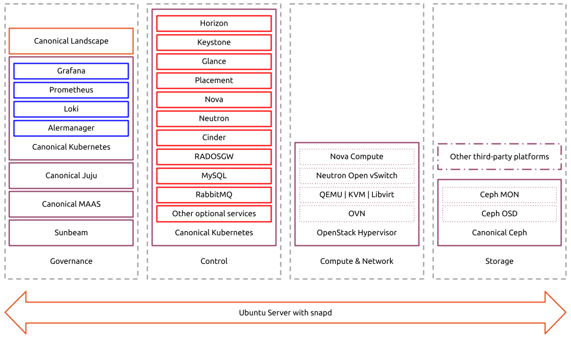
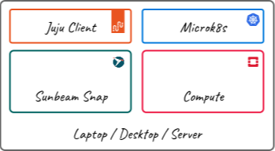
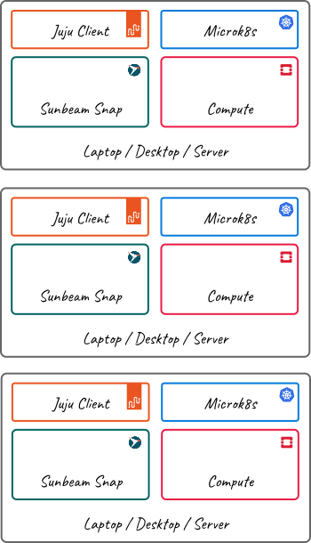

Architecture
============

This section provides an overview of the Canonical OpenStack architecture.

Canonical OpenStack can be deployed as a single-node cloud or can span across
multiple nodes to provide capacity and resilience in a multi-node
solution.

Key concepts
------------

Even though Canonical OpenStack is an enterprise-grade product that is available with a broad range of commercial services, it is built on top of a variety of open source projects and is available free of charge. The following sections provide an overview of these projects and Canonical’s involvement in their development.

OpenStack
~~~~~~~~~

Canonical OpenStack is built on top of the pure upstream OpenStack project, guaranteeing  API
compatibility. Canonical has been involved in OpenStack and the wider OpenInfra community since
the very early beginnings of the project and is the third largest contributor to OpenStack code
over all time.

In the Canonical OpenStack development process Canonical packages the upstream code and makes it
available in the form of various artifacts that are then used to deploy and operate the product.
Only mature and well-maintained services are included to ensure production-grade stability.

Ubuntu
~~~~~~

Canonical OpenStack is only available on top of the Ubuntu operating system (OS). Ubuntu is the most popular OS for OpenStack deployments according to the `Open Infrastructure Foundation (OIF) <https://www.openstack.org/analytics/>`_. Canonical is the publisher and maintainer of Ubuntu, providing its engineering resources and thought leadership in this integral part of the open source ecosystem.

Sunbeam
~~~~~~~

Canonical OpenStack is built on top of Sunbeam. Sunbeam is an upstream OpenStack project under
the governance of the OIF. The project aims to lower the barrier to entry for people with no
previous OpenStack background and fully revolutionize the operational experience. Canonical is the
maintainer and the biggest contributor to the Sunbeam project.

Software architecture
---------------------

Canonical OpenStack uses cloud-native architecture to isolate individual components from each other and fully decouple the software from the underlying OS. In the background the product uses various technologies, open-source projects and other Canonical products that are required to form an end-to-end cloud solution.

Artifacts
~~~~~~~~~

Canonical OpenStack is distributed in the form of three types of artifacts.

Rocks
^^^^^

`Rocks <https://documentation.ubuntu.com/rockcraft/en/stable/>`_ are `OCI-compliant container images <https://opencontainers.org/about/overview/>`_ that are built to be secure and stable by design. Canonical OpenStack uses Rocks for the purpose of hosting OpenStack's control plane services as well as some other software components (i.e. the observability stack).

Snaps
^^^^^

`Snaps <https://snapcraft.io/docs>`_ are application container images that are designed to be strictly confined and secure by default. Canonical OpenStack uses snaps for the purpose of hosting OpenStack's data plane processes as well as many other software components being used in the RA.

Charms
^^^^^^

`Charms <https://juju.is/docs/sdk>`_ are operators – software that wraps an application and that
contains all of the instructions necessary for deploying, configuring, scaling, integrating, etc.
the application. Canonical OpenStack uses Charms for the purpose of deploying and operating many
other artifacts, including Rocks and Snaps.

Functions
---------

All deployed OpenStack services and other software components can be further grouped into four categories of cloud functions:

* **Governance functions** – this includes all the components that are used to deploy, operate, observe and manage the cloud.
* **Control functions** – this includes all the OpenStack's control processes, such as service APIs, schedulers or conductors.
* **Compute & Network functions** – this includes all the OpenStack's compute and network processes, such as Nova Compute workers and Neutron Open vSwitch agents as well as other software components, including QEMU, KVM Libvirt and OVN.
* **Storage functions** – this includes Ceph storage processes or any other third-party storage platform’s processes.
  
A software architecture diagram of Canonical OpenStack is shown in Fig. 1:

   ..

   Fig. 1. Canonical OpenStack software architecture.

.. Image source: https://assets.ubuntu.com/v1/32e2a1ce-Canonical%20OpenStack%20software%20architecture.png

Roles
~~~~~

Each node in a deployment can assume one or more roles; this allows for different topologies to be created where CPU, memory, and storage resources are either shared between roles or dedicated to specific roles.

Juju Controller
^^^^^^^^^^^^^^^

The juju-controller role encapsulates the function the juju controller
serves in the deployment. It is responsible for creating and managing
models as well as the deployment and scaling of charmed applications.
In a multi-node deployment the Juju controller is deployed in a separate
environment to ensure a separation between control plane and workload
tasks.

Sunbeam
^^^^^^^

The sunbeam role provides the operational framework and integration
layer for OpenStack in the deployment. It serves as the mechanism to
deploy, coordinate, and manage OpenStack components across the
underlying infrastructure.

Control
^^^^^^^

The control role encapsulates the control plane of the cloud;
specifically this includes Kubernetes (deployed using Canonical
Kubernetes) and the Charmed K8s Operators that are used for the
OpenStack control plane components - API and RPC services, Database and
Messaging.

Compute
^^^^^^^

The compute role encapsulates the hypervisor component on the cloud;
specifically this includes the Nova Compute service, the Libvirt/QEMU
virtualization stack, OVN (Open Virtual Network) and OVS (Open vSwitch)
services for software defined networking and a Neutron service for
provision of metadata to instances.

Nodes with the compute role should be hardware virtualization (KVM) capable
otherwise user-space emulation is used for instances which has a significant
performance impact.

Storage
^^^^^^^

The storage role encapsulates the software defined storage component of the cloud; this is provided by Ceph which provides a massively scalable storage solution using commodity hardware and is deployed in the form MicroCeph.

Nodes with the storage role must have free, un-partitioned disks for use by Ceph.

Topology
--------

Canonical OpenStack can be deployed as a single-node cloud or can span across multiple nodes to provide capacity and resilience in a multi-node solution.

Single-node
~~~~~~~~~~~

In a single-node deployment, all of the components of the deployed OpenStack Cloud reside on the same node; networking is typically configured so that access to the OpenStack API's, Dashboard and Instances is local and can only be access directly from the node being used.

   ..

   Fig. 2. Single-node topology.

.. Image source: https://assets.ubuntu.com/v1/eac5c9be-Canonical%20OpenStack%20single-node%20topology.png

In a single-node deployment the node will assume control and compute roles by default. Note that the use of the storage role currently requires pristine, un-partitioned block devices on the node being used.

It is possible to deploy a single-node cloud with remote access to control plane services and instances - this is the ``remote`` option for instance networking and requires a range of IP addresses for K8s loadbalancer use on the network upon which the node being used resides - see the :doc:`Install Canonical OpenStack using the manual bare metal provider how-to guide</how-to/install/install-canonical-openstack-using-the-manual-bare-metal-provider>` for examples on how to do this.

Multi-node
~~~~~~~~~~

Multi-node deployments all start off as single-node deployments; additional nodes are added to the cloud to expand the capacity and resilience of the control plane and add additional capacity and resilience to the compute and storage components.

   ..

   Fig. 3. Multi-node topology.

.. Image source: https://assets.ubuntu.com/v1/1f47adf6-Canonical%20OpenStack%20multi-node%20topology.png

.. note ::

   **Important**: High availability, for both the control plane and the data plane, is only achievable with a minimum of three nodes.

MySQL configuration
~~~~~~~~~~~~~~~~~~~

In order to support the scalability and resilience needs of the OpenStack control plane the database component of the control plane can be deployed in two different configurations. This is automatically selected during the bootstrap of the initial node in the cluster but can be overridden if required.

Single instance
---------------

For smaller, single node deployments a single MySQL service is deployed to support all OpenStack services. As this configuration limits the scalability of the control plane it is only recommended for small single-node deployments and is automatically selected when bootstrapping an initial node with less than 32GiB of RAM.

Multiple instances
------------------

For larger, multi-node deployments a MySQL service is deployed for each OpenStack service; each MySQL service will also be automatically scaled for high-availability as the cluster is resized during deployment. This configuration provides a more scalable approach to deployment of the control plan and is automatically selected when bootstrapping an initial node with more than 32GiB of RAM.

Related sections
----------------

* :doc:`Enterprise requirements</reference/enterprise-requirements>`
