Observability
=============

This feature integrates Canonical OpenStack with (and optionally deploys) the
`Canonical Observability Stack
(COS) <https://charmhub.io/topics/canonical-observability-stack>`__.
Sunbeam will automatically propagate default metrics and dashboards,
enabling you to effortlessly monitor the status of your single-node or
multi-node deployment of Sunbeam without the need for any additional
setup.

This feature provides ability to connect to an existing external COS or
deploy COS within the cloud.

Connect to an existing COS
--------------------------

Enabling Observability
~~~~~~~~~~~~~~~~~~~~~~

:doc:`Register the external controller </how-to/misc/manage-external-juju-controllers>`
hosting COS in Canonical OpenStack.

Ensure the Juju user has consume permissions granted on the
observability related offers.

To enable Sunbeam observability integration, run the following
command:

::

   sunbeam enable observability external CONTROLLER GRAFANA_DASHBOARD_OFFER_URL PROMETHEUS_RECEIVE_REMOTE_WRITE_OFFER_URL LOKI_LOGGING_OFFER_URL

``CONTROLLER`` is the name of external Juju controller that hosts COS.

``GRAFANA_DASHBOARD_OFFER_URL`` is the remote Offer URL for Grafana
Dashboard.

``PROMETHEUS_RECEIVE_REMOTE_WRITE_OFFER_URL`` is the remote Offer URL
for Prometheus.

``LOKI_LOGGING_OFFER_URL`` is the remote Offer URL for Loki.

Disabling Observability
~~~~~~~~~~~~~~~~~~~~~~~

To disable Observability, run the following command:

::

   sunbeam disable observability external

Deploy COS in Canonical OpenStack
---------------------------------

.. _enabling-observability-1:

Enabling Observability
~~~~~~~~~~~~~~~~~~~~~~

To enable Observability, run the following command:

::

   sunbeam enable observability internal

.. _disabling-observability-1:

Disabling Observability
~~~~~~~~~~~~~~~~~~~~~~~

To disable Observability, run the following command:

::

   sunbeam disable observability internal

Retrieve Grafana dashboard URL
~~~~~~~~~~~~~~~~~~~~~~~~~~~~~~

To get the URL of the dashboard use the ``dashboard-url`` command:

::

   sunbeam observability dashboard-url

Sample output:

::

   http://10.20.21.13/observability-grafana

This URL points to the Grafana login page. The credentials to use can be
retrieved using this command:

::

   juju run --model observability grafana/leader get-admin-password

Sample output:

.. code:: text

   Running operation 1 with 1 task
     - task 2 on unit-grafana-0

   Waiting for task 2...
   admin-password: ******
   url: http://10.20.21.13/observability-grafana

.. note::
   Only the initial admin password is displayed in the above action. If the
   admin password is changed using the Grafana UI, a message
   ``Admin password has been changed by an administrator`` will be displayed.

Login Grafana dashboard
-----------------------

Once the COS model is deployed, you can use the Grafana dashboard to
view the metrics and alerts configured. The login page asks for the
following information:

**Email or username:** admin **Password:** \*****\*

The login page looks like this:

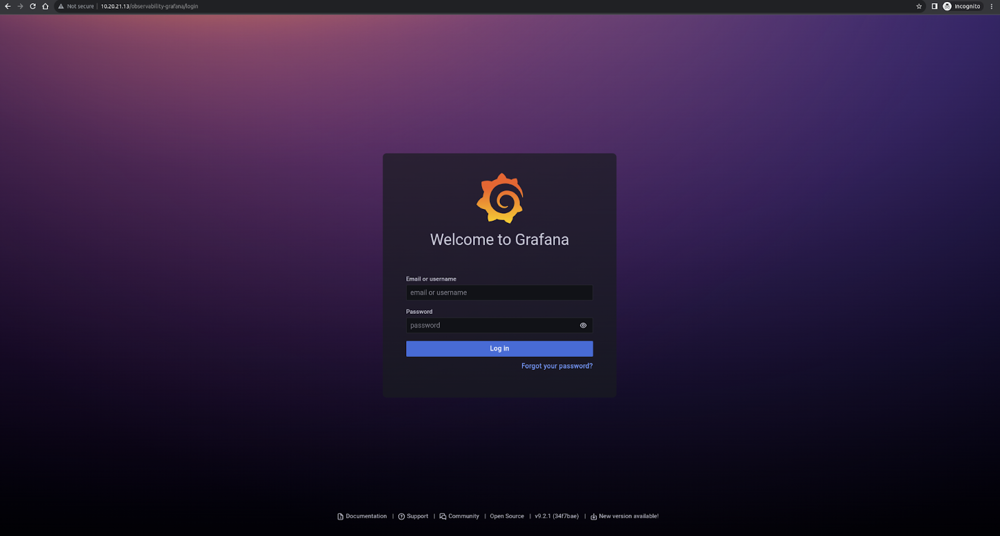

After a successful login, you should see the landing page:

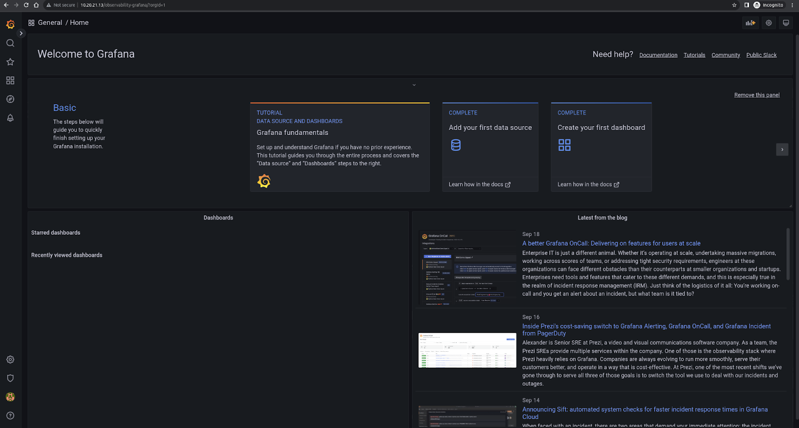

You can now look at the different dashboards configured.

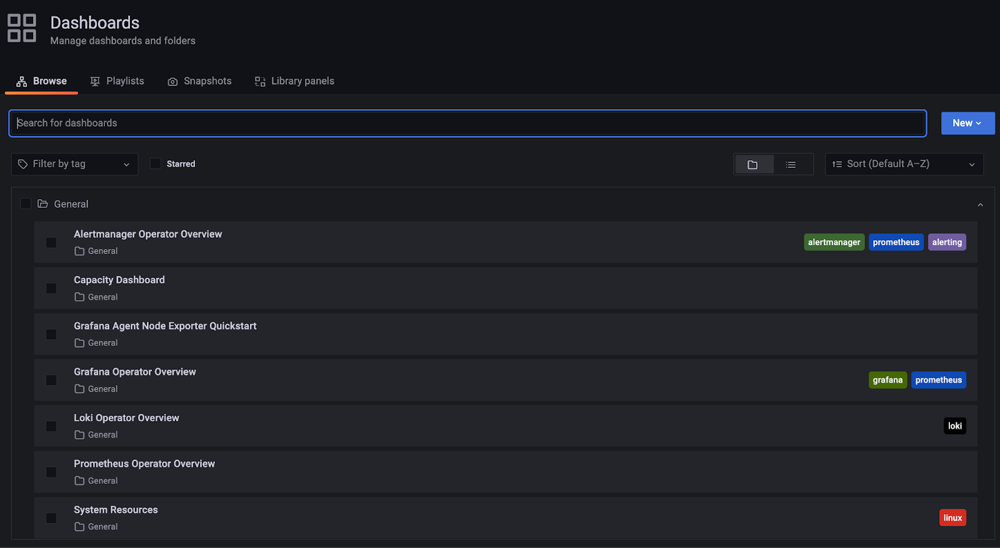

Dashboard
---------

.. note::
   Dashboard is currently only supported in channel ``2023.2`` of the
   **:spelling:ignore:`openstack`** snap.

OpenStack Service Overview dashboard
~~~~~~~~~~~~~~~~~~~~~~~~~~~~~~~~~~~~

This is a dashboard providing an overview of the OpenStack services and
stats.

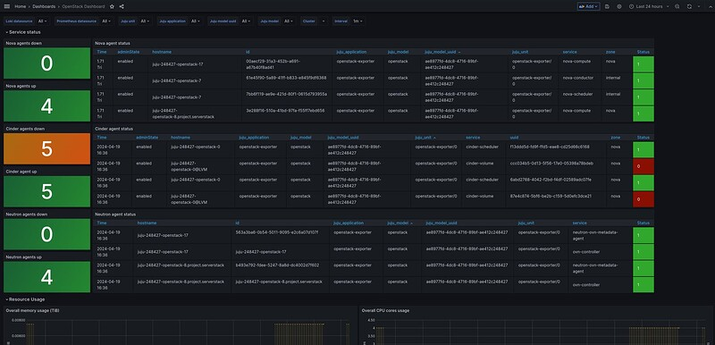

OpenStack Cloud Usage dashboard
~~~~~~~~~~~~~~~~~~~~~~~~~~~~~~~

This is a dashboard providing information on the usage of the OpenStack
cloud (for example, projects and virtual machines), using metrics mostly from
`openstack-exporter <https://github.com/openstack-exporter/openstack-exporter>`__.

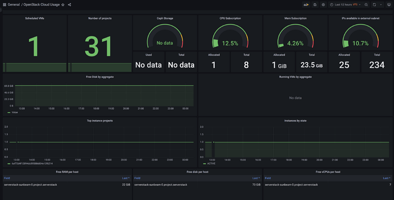

OpenStack Compute Overview dashboard
~~~~~~~~~~~~~~~~~~~~~~~~~~~~~~~~~~~~

This is a dashboard more detailed information on the compute nodes,
using metrics mostly from the Libvirt exporter.

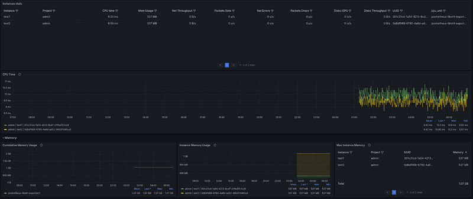

Capacity Dashboard
~~~~~~~~~~~~~~~~~~

**Capacity Dashboard** displays the overall capacity (storage, memory,
and CPU) of the Canonical OpenStack cluster, as well as the capacity of
individual nodes.

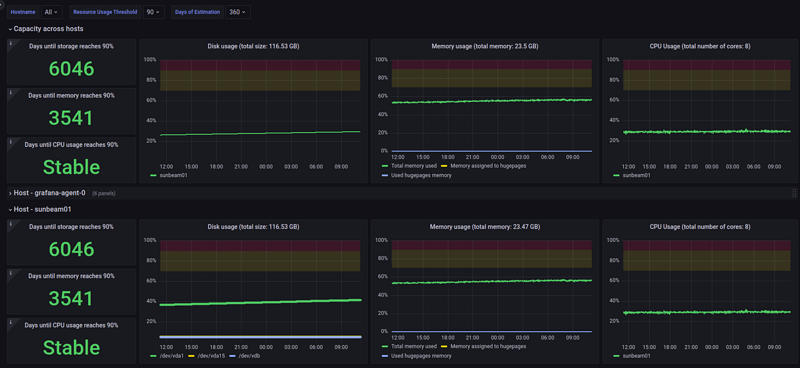

Days until storage / memory / CPU reaches threshold
^^^^^^^^^^^^^^^^^^^^^^^^^^^^^^^^^^^^^^^^^^^^^^^^^^^

“Days until storage / memory / CPU reaches 90%” shows the estimated days
until these resources reach 90% of their total capacity. This is a
linear projection based on the average usage over the past 360 days. If
the average usage is zero or negative, the panel will show “Stable”
because it’s not possible to estimate when they will be depleted. For
the overall capacity, this estimation is chosen to be the minimum value
across all nodes. For example, if the projected days it will
take for storage consumption to reach 90% is about 80 days for node 1,
90 for node 2,, and “Stable” (i.e. not expected to run out given the
current trend) for node 3, then the panel will show “80” since node 1
will be the first one to exhaust its storage.

The node-specific panels estimate resource consumption only within the
given node.

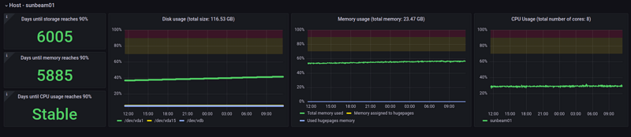

.. note::
   You can filter the nodes using the multi-select dropdown menu: **Hostname**.

.. note::
   The 90% threshold and the 360 days of estimation can also be changed using
   the dropdown menu: **Resource Usage Threshold** and **Days of Estimation**.

Disk usage
^^^^^^^^^^

“Disk usage (total size: …GB)” shows the usage of filesystems mounted on
the nodes. For the overall capacity, “Disk usage” shows the total usage
of all mounted filesystems for each node. The individual disk usage
capacity panel shows disk usage of each mounted filesystem on a
particular node.

Memory usage
^^^^^^^^^^^^

“Memory usage (total memory: …GB)” shows the total memory usage, memory
assigned to huge pages, and used huge pages memory. For the overall
capacity, “Memory usage” is summed over all nodes. The
individual memory capacity panel shows the memory usage of a particular
node.

CPU usage
^^^^^^^^^

“CPU usage (total number of cores: …)” shows the CPU usage on the nodes.
For overall capacity, “CPU usage” shows the CPU usage of each node as
separate series. The individual CPU capacity panel shows the CPU usage
of a particular node.

OpenStack Project Overview dashboard
~~~~~~~~~~~~~~~~~~~~~~~~~~~~~~~~~~~~

This is a dashboard that provides detailed information about a single
project, including limits and a table of virtual machines. It uses
metrics from openstack-exporter.

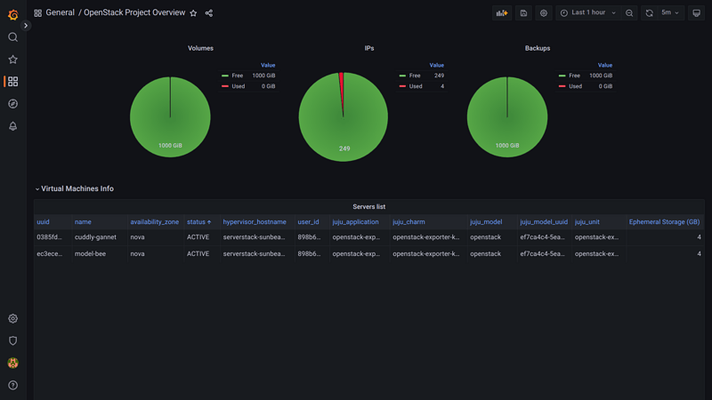

OpenStack Logging dashboard
~~~~~~~~~~~~~~~~~~~~~~~~~~~

This is a dashboard providing a consolidated view of logs
from various OpenStack services,
and also the HTTP status codes from different OpenStack APIs.

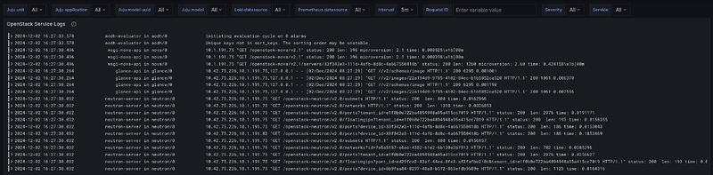

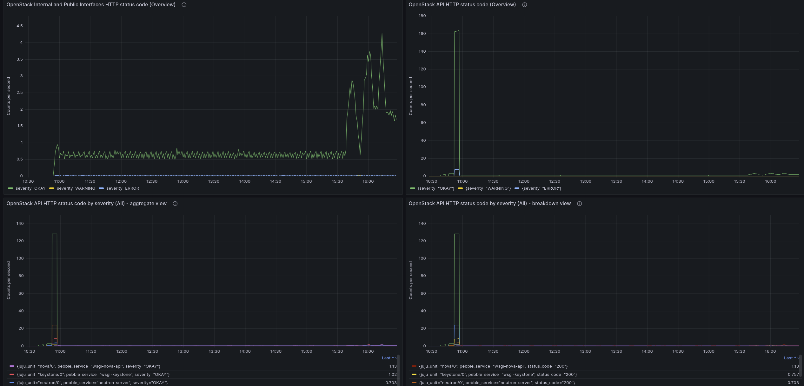
