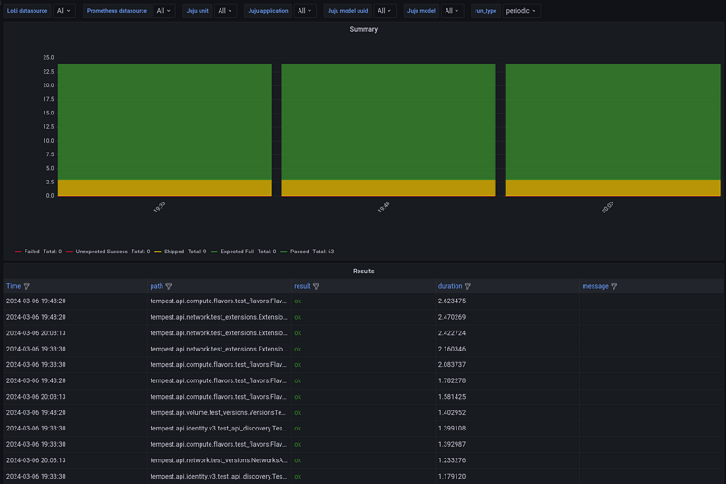

Validation
==========

Overview
--------

This feature deploys `Tempest <https://charmhub.io/tempest-k8s>`__, a
tool for running integration tests, which includes tests for OpenStack
API validation, scenarios, and other specific tests useful in validating
an OpenStack deployment.

Enable Validation
-----------------

To enable Validation, run the following command:

::

   sunbeam enable validation

.. note ::

    During the initialization of Tempest, multiple network resources—including routers, networks, subnets, and ports—will be created on OpenStack.
    Currently, Tempest requires 40 external IP addresses for router gateways.
    Please ensure that at least 40 external IP addresses are available before enabling validation.

Disable Validation
------------------

To disable Validation, run the following command:

::

   sunbeam disable validation

Usage
-----

Validation tests can be run on-demand and they can be scheduled to run
in the background.

On-demand validation
~~~~~~~~~~~~~~~~~~~~

To run a one-time validation test against the deployment, run the
following command:

::

   sunbeam validation run [profile]

If no profile is specified, the validation test defaults to running the
appropriate RefStack profile for the OpenStack version deployed. You can
check the list of available profiles provided by running:

::

   sunbeam validation profiles

Sample output:

::

                                       Available profiles                                                                                                    
     Name       Description                                                                  
    ──────────────────────────────────────────────────────────────────────────────────────── 
     refstack   Tests that are part of the RefStack project https://refstack.openstack.org/  
     quick      A short list of tests for quick validation                                   
     smoke      Tests tagged as "smoke"                                                      
     all        All tests (very large number, not usually recommended)                       
              

A summary of the validation result will be printed out to the screen
upon completion of the command:

::

   Totals
   ======
   Ran: 115 tests in 1036.6368 sec.
    - Passed: 70
    - Skipped: 19
    - Expected Fail: 0
    - Unexpected Success: 0
    - Failed: 26
   Sum of execute time for each test: 718.3638 sec.

In order to obtain detailed test results, use the ``--output`` option
and specify a local path to save the result file to:

::

   sunbeam validation run --output ./validation.log

The result of the most recent run can be retrieved with:

::

   sunbeam validation get-last-result --output ./validation.log

Periodic validation
~~~~~~~~~~~~~~~~~~~

If the :doc:`Observability </how-to/features/observability>` feature is also enabled,
periodic validation tests will be performed using the ``quick`` profile.

By default, periodic checks are scheduled to execute on an hourly basis.
You can configure this frequency to a 5-field
`cron <https://en.wikipedia.org/wiki/Cron>`__ schedule, which specifies
the interval between checks. For example, if you would like periodic
checks to be run every 6 hours on the first minute, run the following
command:

::

   sunbeam configure validation schedule="1 */6 * * *"

Periodic checks can also be disabled by setting the schedule parameter
to an empty string:

::

   sunbeam configure validation schedule=""

.. note::
   Due to performance considerations, intervals under 15 minutes are not supported.

Results will be displayed in a validation-specific Grafana dashboard and
alerts will be fired when periodic checks fail. For more information on
how to access Grafana dashboards and receive alerts, please refer to the
:doc:`Observability </how-to/features/observability>` feature documentation.

   Screenshot from 2024-03-06 20-13-37|800x533
