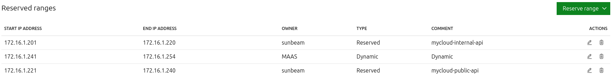
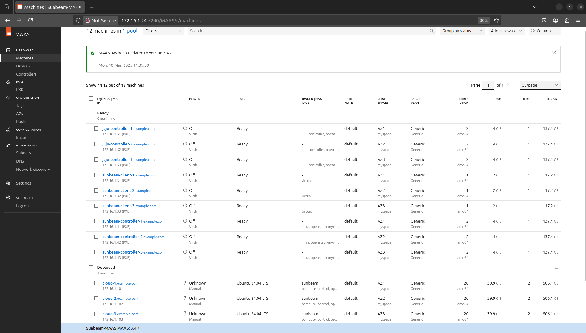
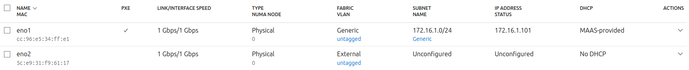
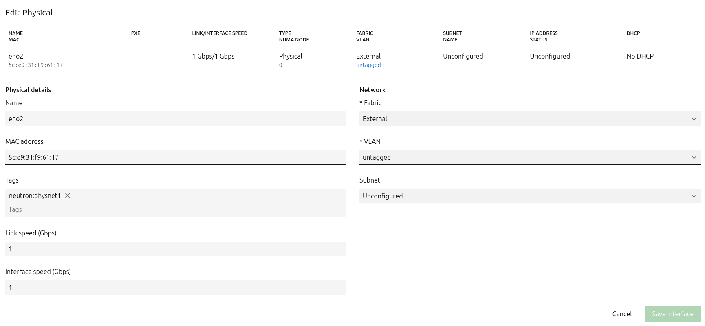

Install Canonical OpenStack using Canonical MAAS
================================================

This how-to guide provides all necessary information to install `Canonical OpenStack`_ with
Sunbeam using `Canonical MAAS`_.

Make sure you get familiar with the following sections before proceeding with any instructions
listed below:

* :doc:`Architecture</explanation/architecture>`
* :doc:`Design considerations</explanation/design-considerations>`
* :doc:`Network traffic isolation with MAAS</explanation/network-traffic-isolation-with-maas>`
* :doc:`Enterprise requirements</reference/enterprise-requirements>`
* :doc:`Example physical configuration</reference/example-physical-configuration>`

.. note ::

   This how-to guide is intended to serve operators willing to deploy a production-grade cloud.
   If you're looking for some simple learning materials instead, please refer to the
   :doc:`Tutorials</tutorial/index>` section of this documentation.

Requirements
++++++++++++

You will need:

* at least two dedicated physical networks with an unlimited access to the Internet
* one (or at least three for full HA) dedicated physical machine(s) with:

  * hardware specifications matching minimum hardware specifications for the *Cloud* node as
    documented under the :doc:`Enterprise requirements</reference/enterprise-requirements>` section

* one (or at least three for full HA) dedicated physical machine(s) with:

  * hardware specifications matching minimum hardware specifications for the *Governor* node as
    documented under the :doc:`Enterprise requirements</reference/enterprise-requirements>` section
  * fresh Ubuntu Server 24.04 LTS installed

* one (or at least three for full HA) dedicated virtual machine(s), running on the *Governor*
  node(s), with:

  * hardware specifications matching minimum hardware specifications for the *MAAS* node as
    documented under the :doc:`Enterprise requirements</reference/enterprise-requirements>` section
  * fresh Ubuntu Server 24.04 LTS installed
 
* one (or at least three for full HA) dedicated virtual machine(s), running on the *Governor*
  node(s), with:

  * hardware specifications matching minimum hardware specifications for the *Sunbeam Client* node
    as documented under the :doc:`Enterprise requirements</reference/enterprise-requirements>` section
  * fresh Ubuntu Server 24.04 LTS installed

* one (or at least three for full HA) dedicated virtual machine(s), running on the *Governor*
  node(s), with:
  
  * hardware specifications matching minimum hardware specifications for the *Sunbeam Controller*
    node as documented under the :doc:`Enterprise requirements</reference/enterprise-requirements>` section

* one (or at least three for full HA) dedicated virtual machine(s), running on the *Governor*
  node(s), with:

  * hardware specifications matching minimum hardware specifications for the *Juju Controller*
    node as documented under the :doc:`Enterprise requirements</reference/enterprise-requirements>` section

If you can't provide unlimited access to the Internet, see the :doc:`Manage a proxied
environment </how-to/misc/manage-a-proxied-environment>` page.

Additional machines can always be added later. See the :doc:`Scaling the cluster out</how-to/operations/scaling-the-cluster-out>` how-to guide.

Install Canonical OpenStack
+++++++++++++++++++++++++++

The following section assumes a generic knowledge of OpenStack and Canonical MAAS. Please refer to
the upstream `OpenStack documentation <https://docs.openstack.org/>`_ and `MAAS documentation`_
for more information.

Pick a deployment name
----------------------

Before you get started you have to pick a name for your Canonical OpenStack deployment. This
name will be used in various parts of this how-to guide. We'll refer to it as a *deployment name*.

.. _prerequisites:

Prepare the environment
-----------------------

When using Canonical MAAS as a bare metal provider, all machines in the OpenStack cluster get
deployed at once. This means the whole environment has to be prepared first before proceeding
with Canonical OpenStack installation. Please refer to the following checklist to make sure that
your environment is set up correctly.

Install and configure MAAS
^^^^^^^^^^^^^^^^^^^^^^^^^^

Sunbeam expects a working MAAS environment to be able to install Canonical OpenStack using
Canonical MAAS.

In the :doc:`Example physical configuration</reference/example-physical-configuration>` section Canonical MAAS gets installed on `maas-1`, `maas-2` and `maas-3`
machines in the HA mode. All of them are VMs running on Governor nodes.

Create reserved IP ranges for OpenStack API endpoints
"""""""""""""""""""""""""""""""""""""""""""""""""""""

In addition to some generic settings operators must create reserved IP ranges for OpenStack API
endpoints.

Those ranges have to be created under subnets that :ref:`will be further mapped<mapping>` to
``internal`` and ``public`` cloud networks, and labeled with ``<name>-internal-api``, and
``<name>-public-api`` accordingly where the ``<name>`` prefix matches the deployment name.
Depending on the number of optional features being used, you have to account for around 10-20
IP addresses per each range.

Reserved IP ranges from the :doc:`Example physical configuration</reference/example-physical-configuration>` section would look like as follows:

Refer to `MAAS documentation`_ for more information on creating reserved IP ranges.

Enlist, commission and configure machines
^^^^^^^^^^^^^^^^^^^^^^^^^^^^^^^^^^^^^^^^^

All machines but the Governor and Sunbeam Client nodes must be enlisted, commissioned and
configured in MAAS.

In the :doc:`Example physical configuration</reference/example-physical-configuration>` section `sunbeam-controller-1`, `sunbeam-controller-2`, `sunbeam-controller-3`,
`juju-controller-1`, `juju-controller-2` and `juju-controller-3` machines are VMs running on
Governor nodes.

Assign machine tags
"""""""""""""""""""

In addition to some generic settings operators must assign machine tags to all nodes that they
intend to use in their deployment.

Please refer to the following table for information on which machine tags to assign to which nodes
in the cluster:

.. list-table :: Tab. 1. Machine tags assignment.
   :header-rows: 1

   * - Machine tag
     - Purpose
     - Nodes to assign the tag to
   * - openstack-<name>
     - Defines which machines to use in this particular deployment
     - Cloud, Control, Compute, Storage, Sunbeam Controller, Juju Controller
   * - control
     - Defines where to host cloud control functions
     - Cloud, Control
   * - compute
     - Defines where to host cloud compute functions
     - Cloud, Compute
   * - storage
     - Defines where to host cloud storage functions
     - Cloud, Storage
   * - sunbeam
     - Defines where to host the Sunbeam controller
     - Sunbeam Controller
   * - juju-controller
     - Defines where to host the Juju controller
     - Juju Controller

Note that the ``<name>`` suffix must match the deployment name.

Machines from the :doc:`Example physical configuration</reference/example-physical-configuration>` section would look like as follows:

Refer to `MAAS documentation`_ for more information on assigning machine tags.

Configure network
"""""""""""""""""

In addition to configuring network interfaces attached to the Generic physical network (or any
other physical networks if using more than one for traffic segmentation purposes), operators must
also configure the network interface attached to the External physical network. This is done by
leaving the *Subnet* field of this interface as *Unconfigured* and assigning the
``neutron:physnet1`` network tag.

For example, network configuration of the *cloud-1* machine from the :doc:`Example physical configuration</reference/example-physical-configuration>`
section would look like as follows:

Refer to `MAAS documentation`_ for more information on assigning network tags.

Configure storage
"""""""""""""""""

All storage devices that are expected to serve as Ceph OSDs must have the ``ceph`` storage tag
assigned.

In the example configuration those would be ``/dev/sdb`` devices on *cloud-1*, *cloud-2* and
*cloud-3* machines.

Refer to `MAAS documentation`_ for more information on assigning storage tags.

Install the snap
----------------

.. note ::

   All terminal commands used in this how-to guide are run from the first *Sunbeam Client* machine
   (aka primary node).

First, install the ``openstack`` snap:

.. code-block :: text

   sudo snap install openstack

This will install the latest stable version by default. You can use the ``--channel`` switch to
install a different version of OpenStack instead.

To list all available versions, execute the following command:

.. code-block :: text

   snap info openstack

Prepare the machine
-------------------

To prepare the machine for Canonical OpenStack usage, execute the following command:

.. code-block :: text
   
   sunbeam prepare-node-script --client | bash -x

This command will:

* install the Juju client,
* create any necessary data directories.

Alternatively, you can let Sunbeam generate a script that you can further review and execute step
by step:

.. code-block :: text

   sunbeam prepare-node-script --client

Add the Canonical MAAS provider
-------------------------------

By default Sunbeam doesn't know how to talk to Canonical MAAS. Therefore, information about the
Canonical MAAS provider have to be provided by the operator first.

In order to add the Canonical MAAS provider, execute the ``sunbeam deployment add`` command:

.. code-block :: text

   sunbeam deployment add maas NAME TOKEN URL

``NAME`` is the deployment name.

``TOKEN`` is the MAAS API key.

``URL`` is the MAAS URL.

For example, to add the Canonical MAAS provider from the :doc:`Example configuration section</reference/example-physical-configuration>`, execute
the following command:

.. code-block :: text

   sunbeam deployment add maas mycloud Nehk886eajph68tGEK:HcaG27ACee2X2LuPA2:2GtynUxLHXWmQsRYznKahfy3F6D8e4ex http://172.16.1.14:5240/MAAS

.. _mapping:

Map network spaces to cloud networks
------------------------------------

Certain machines need access to certain cloud networks. This is managed through the concept of
:doc:`MAAS network spaces to cloud networks mapping</explanation/network-traffic-isolation-with-maas>`.

To map network space to cloud network, execute the ``sunbeam deployment space map`` command:

.. code-block :: text

   sunbeam deployment space map SPACE NETWORK

``SPACE`` is the MAAS space.

``NETWORK`` is the cloud network (a traffic group).

For example, to map network spaces to cloud networks from the example configuration section,
execute the following commands:

.. code-block :: text

   sunbeam deployment space map myspace

This will map all cloud networks to one network space (``myspace``) at once, meaning that all
types of network traffic, but the North-South traffic which is configured through the network
tags assignment, will use physical networks under the ``myspace`` network space.

Validate the provider
---------------------

Sunbeam expects a :ref:`correctly configured MAAS provider<prerequisites>` to be able to install
Canonical OpenStack.

To check whether your environment is ready, execute the following command:

.. code-block :: text

   sunbeam deployment validate

Sample output:

.. code-block :: text

   Checking machines, roles, networks and storage... WARN
   Checking zone distribution... WARN
   Checking networking... OK
   Report saved to '/home/guardian/snap/openstack/common/reports/validate-deployment-mycloud-20241107-111400.097496.yaml'

A report will be generated under ``$HOME/snap/openstack/common/reports`` if a failure is detected.
A sample failure might look like this:

.. code-block :: text

   - diagnostics: A machine root disk needs to be at least 500GB to be a part of an openstack
       deployment.
     machine: cloud-1
     message: root disk is too small
     name: Root disk check
     passed: warning

.. note ::

   A validation error will lessen the chances of a successful deployment but it will not block an
   attempted deployment.
   
Bootstrap the orchestration layer
---------------------------------

To bootstrap the orchestration layer, execute the following command:

.. code-block :: text

   sunbeam cluster bootstrap

When prompted, answer some interactive questions. Below is a sample output from the *client-1*
machine from the :doc:`Example physical configuration</reference/example-physical-configuration>` section:

.. code-block :: text

   Use proxy to access external network resources? [y/n] (n): n

You can also refer to the :doc:`Interactive configuration prompts</reference/interactive-configuration-prompts>` section for detailed description of
each of those questions and some examples.

Also note that answers to all those questions can be automated with the use of a
:doc:`Deployment manifest</explanation/deployment-manifest>`.

One finished, you should be able to see the following message on your screen:

.. code-block :: text

   Bootstrap controller components complete.

Bootstrap the cloud
-------------------

To bootstrap the cloud, execute the following command:

.. code-block :: text

   sunbeam cluster deploy

When prompted, answer some interactive questions. Below is a sample output from the *client-1*
machine from the :doc:`Example physical configuration</reference/example-physical-configuration>` section:

.. code-block :: text

   Enter database toplogy: single/multi (cannot be changed later) (single): single
   Enter a region name (cannot be changed later) (RegionOne): RegionOne

You can also refer to the :doc:`Interactive configuration prompts</reference/interactive-configuration-prompts>` section for detailed description of
each of those questions and some examples.

Also note that answers to all those questions can be automated with the use of a
:doc:`Deployment manifest</explanation/deployment-manifest>`.

One finished, you should be able to see the following message on your screen:

.. code-block :: text

   Deployment complete with 3 control, 3 compute and 3 storage nodes. Total nodes in cluster: 3

Configure the cloud
-------------------

Finally, configure the cloud for sample usage:

.. code-block :: text

   sunbeam configure

Unless directed otherwise, this command will create sample project and user account. You can use
the ``--openrc`` switch to automatically generate an OpenStack RC file for this user
(e.g. ``--openrc my-openrc``).

When prompted, answer some interactive questions. Below is a sample output from the *client-1*
machine from the :doc:`Example physical configuration</reference/example-physical-configuration>` section:

.. code-block :: text

   External network (172.16.2.0/24): 172.16.2.0/24
   External network's gateway (172.16.2.1): 172.16.2.1
   External network's allocation range (172.16.2.2-172.16.2.254): 172.16.2.2-172.16.2.254
   External network's type  [flat/vlan] (flat): flat
   Populate OpenStack cloud with demo user, default images, flavors etc [y/n] (y): y
   Username to use for access to OpenStack (demo): demo
   Password to use for access to OpenStack (dH********): 
   Project network (192.168.0.0/24): 192.168.0.0/24
   Project network's nameservers (8.8.8.8): 8.8.8.8
   Enable ping and SSH access to instances? [y/n] (y): y

You can also refer to the :doc:`Interactive configuration prompts</reference/interactive-configuration-prompts>` section for detailed description of
each of those questions and some examples.

Also note that answers to all those questions can be automated with the use of a
:doc:`Deployment manifest</explanation/deployment-manifest>`.

One finished, you should be able to see the following message on your screen:

.. code-block :: text

   The cloud has been configured for sample usage.
   You can start using the OpenStack client or access the OpenStack dashboard at
   http://172.16.1.223:80/openstack-horizon

Note that the IP address of the OpenStack dashboard (here ``172.16.1.223``) might be different
in your environment.

Related Guides
++++++++++++++

Now that Canonical OpenStack is installed, you might want to check out the following how-to guides:

* :doc:`Using the OpenStack dashboard</how-to/misc/using-the-openstack-dashboard>`
* :doc:`Using the OpenStack client</how-to/misc/using-the-openstack-cli>`
* :doc:`Scaling the cluster out</how-to/operations/scaling-the-cluster-out>`

.. LINKS
.. _MAAS documentation: https://maas.io/docs
