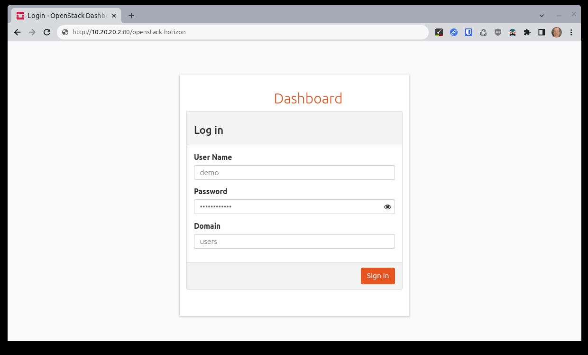
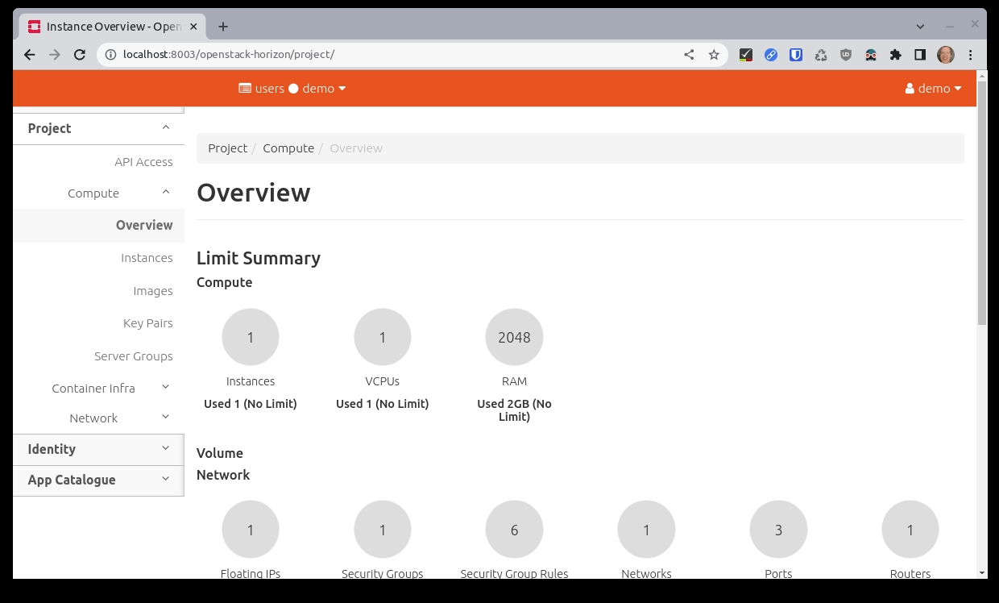

.. _Accessing the OpenStack Dashboard:

Accessing the OpenStack Dashboard
=================================

Once OpenStack has been deployed you can use the OpenStack dashboard
(Horizon) to manage it by using a web UI. To get the URL of the
dashboard use the ``dashboard-url`` command:

::

   sunbeam dashboard-url

Sample output:

::

   http://10.20.20.2:80/openstack-horizon

This URL points to Horizon login page. The credentials to use are stored
in a previously generated credentials file (e.g. ``demo-openrc``).

The login page asks for three pieces of information. For example:

**User Name:** ``demo`` **Password:** \*******\* **Domain:** ``users``

The password is the value of variable ``OS_PASSWORD`` in the credentials
file.

The login page looks like this:

After a successful login, you should see the landing page:

You can now start managing your OpenStack cloud (e.g. create additional
users, launch server instances, etc.).
