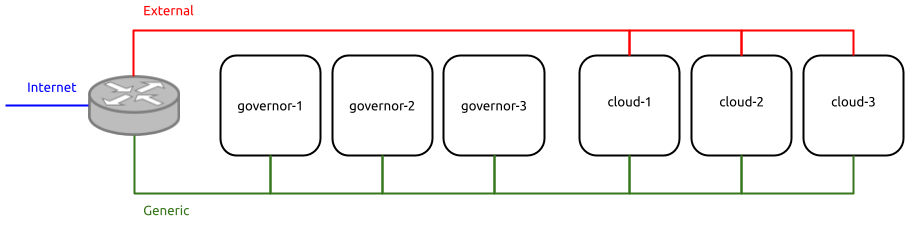

Example physical configuration
##############################

Sunbeam requires a properly cabled and configured hardware to be able to install Canonical OpenStack. Therefore, we use one example physical configuration across all examples in this documentation. It is highly recommended that you use exactly the same configuration in your environment until you become proficient with both OpenStack and Sunbeam.

.. note ::
  Depending on your scenario you might not need both physical networks and all six machines.
  Please refer to instructions under tutorials and how-go guides for exact hardware requirements
  for each scenario.

Layout
++++++

Example physical configuration layout is shown in Fig. 1:

   ..

   Fig. 1. Example physical configuration layout.

.. Image source: https://assets.ubuntu.com/v1/0400fd56-Minimal%20network%20setup.png

Networks
++++++++

The following section documents example physical configuration of networks.

Physical networks
-----------------

Canonical OpenStack requires at least two physical networks to function properly:

* **External** – used to provide an inbound (south) access to virtual machines (VMs) running on top of OpenStack through the mechanism of floating IPs, and outbound (north) access from instances to networks outside of OpenStack.
* **Generic** – used for any other purposes (machine provisioning, machine management, providing access to OpenStack APIs, etc.).

Those should be plugged into a router with an access to the Internet as shown in Fig. 1.

Virtual networks
----------------

In addition to physical networks listed above, Canonical OpenStack uses virtual networks to
provide an inter-VM communication for tenant's workloads running inside of a project. These
networks are not routable outside of the Canonical OpenStack installation. We will use one such
network in the example configuration and we will refer to it as **Project** in all parts of the
documentation.

Reference parameters
--------------------

Some reference parameters of those three networks are listed in Tab. 1 below:

.. list-table :: Tab. 1. Reference network parameters.
   :header-rows: 1

   * - Network
     - Type
     - CIDR
     - Gateway
     - Nameserver
     - Domain
     - MAAS space
   * - Generic
     - Physical
     - 172.16.1.0/24
     - 172.16.1.1
     - 8.8.8.8
     - example.com
     - myspace
   * - External
     - Physical
     - 172.16.2.0/24
     - 172.16.2.1
     - N/A
     - N/A
     - myspace
   * - Project
     - Virtual
     - 192.168.0.0/24
     - 192.168.0.1
     - 8.8.8.8
     - N/A
     - N/A

Some IP addresses from those networks will be directly assigned to the :ref:`machines being used<machines>`. However, some other IPs will serve for special purposes instead. Those require dedicated ranges to be defined.

Some reference IP ranges are listed in Tab. 2 below:

.. list-table :: Tab. 2. Reference IP address ranges.
   :header-rows: 1

   * -
     - IP address range
     - MAAS label
   * - DHCP lease range for MAAS
     - 172.16.1.61 - 172.16.1.100
     - N/A
   * - OpenStack internal APIs
     - 172.16.1.201 - 172.16.1.220
     - mycloud-internal-api
   * - OpenStack public APIs
     - 172.16.1.221 - 172.16.1.240
     - mycloud-public-api
   * - OpenStack floating IPs
     - 172.16.2.2 - 172.16.2.254
     - N/A

Machines
++++++++

The following section documents example physical configuration of machines.

Physical machines
-----------------

The example physical configuration assumes 3 Cloud nodes and 3 Governor nodes spread across 3 different physical zones for full HA regardless of the cloud architecture being used. Depending on your scenario you might not need all six machines. Please refer to instructions under tutorials and how-go guides for exact hardware requirements for each scenario.

Virtual machines
----------------

In addition to physical machines listed above, Canonical OpenStack can use virtual machines for the purpose of hosting cloud governance services. In the example physical configuration those are hosted on Governor nodes.

.. _machines:

Reference parameters
--------------------

Some basic reference parameters of all those machines are listed in Tab. 3 below:

.. list-table :: Tab. 3. Basic reference machine parameters.
   :header-rows: 1

   * - Machine
     - Type
     - Host
     - Ceph device
     - NIC
     - Network
     - IP
   * - cloud-1
     - Physical
     - N/A
     - /dev/sdb
     - | eno1
       | eno2
     - | Generic
       | External
     - | 172.16.1.101
       | Unconfigured
   * - cloud-2
     - Physical
     - N/A
     - /dev/sdb
     - | eno1
       | eno2
     - | Generic
       | External
     - | 172.16.1.102
       | Unconfigured
   * - cloud-3
     - Physical
     - N/A
     - /dev/sdb
     - | eno1
       | eno2
     - | Generic
       | External
     - | 172.16.1.103
       | Unconfigured
   * - governor-1
     - Physical
     - N/A
     - N/A
     - eno1
     - Generic
     - 172.16.1.11
   * - governor-2
     - Physical
     - N/A
     - N/A
     - eno1
     - Generic
     - 172.16.1.12
   * - governor-3
     - Physical
     - N/A
     - N/A
     - eno1
     - Generic
     - 172.16.1.13
   * - maas-1
     - Virtual
     - governor-1
     - N/A
     - eno1
     - Generic
     - 172.16.1.21
   * - maas-2
     - Virtual
     - governor-1
     - N/A
     - eno1
     - Generic
     - 172.16.1.22
   * - maas-3
     - Virtual
     - governor-1
     - N/A
     - eno1
     - Generic
     - 172.16.1.23
   * - sunbeam-client-1
     - Virtual
     - governor-1
     - N/A
     - eno1
     - Generic
     - 172.16.1.31
   * - sunbeam-client-2
     - Virtual
     - governor-2
     - N/A
     - eno1
     - Generic
     - 172.16.1.32
   * - sunbeam-client-3
     - Virtual
     - governor-3
     - N/A
     - eno1
     - Generic
     - 172.16.1.33
   * - sunbeam-controller-1
     - Virtual
     - governor-1
     - N/A
     - eno1
     - Generic
     - 172.16.1.41
   * - sunbeam-controller-2
     - Virtual
     - governor-2
     - N/A
     - eno1
     - Generic
     - 172.16.1.42
   * - sunbeam-controller-3
     - Virtual
     - governor-3
     - N/A
     - eno1
     - Generic
     - 172.16.1.43
   * - juju-controller-1
     - Virtual
     - governor-1
     - N/A
     - eno1
     - Generic
     - 172.16.1.51
   * - juju-controller-2
     - Virtual
     - governor-2
     - N/A
     - eno1
     - Generic
     - 172.16.1.52
   * - juju-controller-3
     - Virtual
     - governor-3
     - N/A
     - eno1
     - Generic
     - 172.16.1.53
   * - observability-1
     - Virtual
     - governor-1
     - N/A
     - eno1
     - Generic
     - 172.16.1.61
   * - observability-2
     - Virtual
     - governor-2
     - N/A
     - eno1
     - Generic
     - 172.16.1.62
   * - observability-3
     - Virtual
     - governor-3
     - N/A
     - eno1
     - Generic
     - 172.16.1.63
   * - landscape-1
     - Virtual
     - governor-1
     - N/A
     - eno1
     - Generic
     - 172.16.1.71
   * - landscape-2
     - Virtual
     - governor-2
     - N/A
     - eno1
     - Generic
     - 172.16.1.72
   * - landscape-3
     - Virtual
     - governor-3
     - N/A
     - eno1
     - Generic
     - 172.16.1.73

When using Canonical MAAS as a bare metal provider, some additional parameters have to be set up first. Those are listed in Tab. 4:

.. list-table :: Tab. 4. Additional reference machine parameters.
   :widths: 20 10 35 15 20
   :header-rows: 1

   * - Machine
     - Zone
     - Tags
     - Storage tag (/dev/sdb)
     - Network tag (eno2)
   * - cloud-1
     - AZ1
     - openstack-mycloud, control, compute, storage
     - ceph
     - neutron:physnet1
   * - cloud-2
     - AZ2
     - openstack-mycloud, control, compute, storage
     - ceph
     - neutron:physnet1
   * - cloud-3
     - AZ3
     - openstack-mycloud, control, compute, storage
     - ceph
     - neutron:physnet1
   * - sunbeam-controller-1
     - AZ1
     - openstack-mycloud, sunbeam
     -
     -
   * - sunbeam-controller-2
     - AZ2
     - openstack-mycloud, sunbeam
     -
     -
   * - sunbeam-controller-3
     - AZ3
     - openstack-mycloud, sunbeam
     -
     -
   * - juju-controller-1
     - AZ1
     - openstack-mycloud, juju-controller
     -
     -
   * - juju-controller-2
     - AZ2
     - openstack-mycloud, juju-controller
     -
     -
   * - juju-controller-3
     - AZ3
     - openstack-mycloud, juju-controller
     -
     -
   * - observability-1
     - AZ1
     -
     -
     -
   * - observability-2
     - AZ2
     -
     -
     -
   * - observability-3
     - AZ3
     -
     -
     -
   * - landscape-1
     - AZ1
     -
     -
     -
   * - landscape-2
     - AZ2
     -
     -
     -
   * - landscape-3
     - AZ3
     -
     -
     -

Canonical MAAS
++++++++++++++

The following section documents example configuration of Canonical MAAS bare metal provider:

* **Deployment name** - ``mycloud``
* **Token** - ``Nehk886eajph68tGEK:HcaG27ACee2X2LuPA2:2GtynUxLHXWmQsRYznKahfy3F6D8e4ex``
* **VIP** - ``172.16.1.24``
