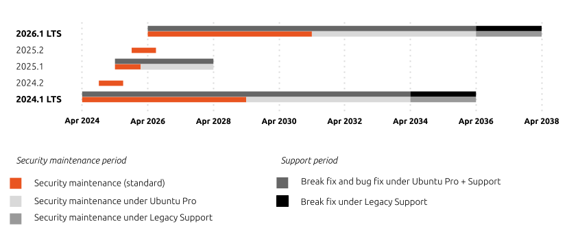
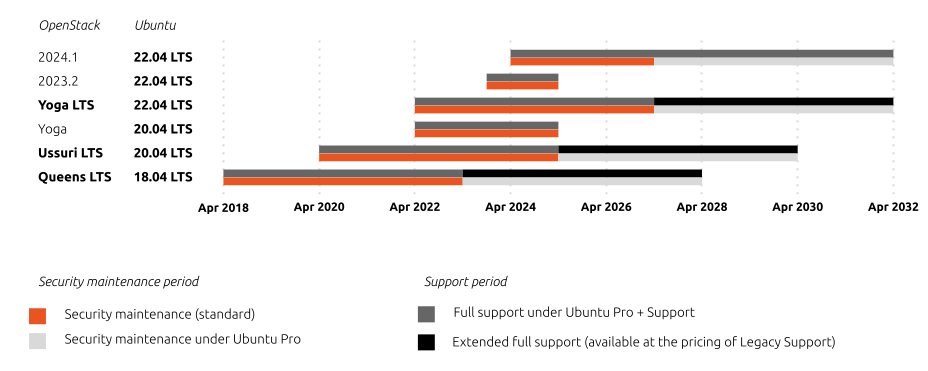
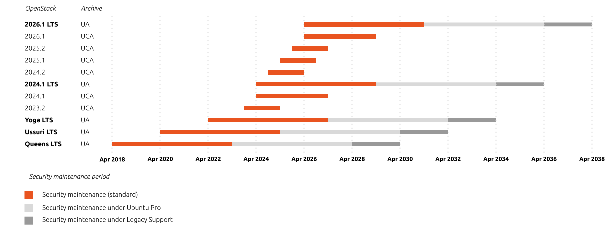

Release cycle and supported versions
####################################

The release cycle of Canonical OpenStack is tightly synchronized with the release cycle of upstream OpenStack. At the same time the release cycle of upstream OpenStack roughly follows the release cycle of Ubuntu. This means that new versions of Canonical OpenStack are released twice a year: usually in April and October.

Canonical OpenStack (based on Sunbeam)
++++++++++++++++++++++++++++++++++++++

OpenStack clouds deployed with Sunbeam benefit from security maintenance and full support under `Ubuntu Pro + Support <https://ubuntu.com/pro>`_, `Ubuntu Pro (Infra-only) + Support <https://ubuntu.com/pro>`_ and `Legacy Support <https://ubuntu.com/support>`_.

The first long term support (LTS) version of Canonical OpenStack (based on Sunbeam) is 2024.1. Every LTS version will benefit from up to 12 years of full support moving forward.

Full support will also be available on every second interim version. Users will be able to securely upgrade between supported versions using the `Skip Level Upgrade Release Process (SLURP) mechanism <https://docs.openstack.org/project-team-guide/release-cadence-adjustment.html>`_ for 2 years after the next LTS version release.

OpenStack
---------

Canonical OpenStack (based on Sunbeam) release cycle can be represented this way:

   ..

   Fig. 1. Canonical OpenStack (based on Sunbeam) release cycle.

.. TODO: Replace the Fig. 1 image with the one created by the Design team

Also refer to the table below:

.. list-table :: Tab. 1. Supported versions of Canonical OpenStack (based on Sunbeam).
   :header-rows: 1

   * - OpenStack version
     - Released
     - EOL (standard)
     - EOL (under Ubuntu Pro)
     - EOL (under Legacy Support)
   * - 2026.1 LTS
     - Apr 2026 (expected)
     - Apr 2031
     - Apr 2036
     - Apr 2038
   * - 2025.2
     - Oct 2025 (expected)
     - Jul 2026
     - Jul 2026
     - Jul 2026
   * - 2025.1
     - Apr 2025 (expected)
     - Jan 2026
     - Apr 2028    
     - Apr 2028
   * - 2024.2
     - Jan 2025
     - Jul 2025
     - Jul 2025
     - Jul 2025
   * - 2024.1 LTS
     - Jan 2025
     - Apr 2029
     - Apr 2034
     - Apr 2036

Ubuntu
------

Canonical recommends using the latest LTS version of Ubuntu Server for the purpose of running Canonical OpenStack. However, customers can also use an older (n – 1) LTS version of Ubuntu, while running a newer version of OpenStack. The list of supported and some future versions of Canonical OpenStack with their corresponding supported Ubuntu versions is shown in Tab. 2:

.. list-table :: Tab. 2. Canonical OpenStack support matrix.
   :header-rows: 1

   * - 
     - OpenStack 2024.1 LTS
     - OpenStack 2025.1
     - OpenStack 2026.1 LTS
     - OpenStack 2027.1
     - OpenStack 2028.1 LTS
   * - **Ubuntu 24.04 LTS**
     - ✓
     - ✓
     - ✓
     - X
     - X
   * - **Ubuntu 26.04 LTS**
     - X
     - X
     - ✓
     - ✓
     - ✓
   * - **Ubuntu 28.04 LTS**
     - X
     - X
     - X
     - X
     - ✓

Canonical OpenStack (based on OpenStack Charms), aka Charmed OpenStack
++++++++++++++++++++++++++++++++++++++++++++++++++++++++++++++++++++++

OpenStack clouds deployed with OpenStack Charms under the Private Cloud Build (PCB) engagement or validated by Canonical under the Cloud Validation (CV) engagement (aka Charmed OpenStack clouds) also benefit from security maintenance and full support under `Ubuntu Pro + Support <https://ubuntu.com/pro>`_ and `Ubuntu Pro (Infra-only) + Support <https://ubuntu.com/pro>`_.

Canonical OpenStack (based on OpenStack Charms) release cycle can be represented this way:

   ..

   Fig. 2. Canonical OpenStack (based on OpenStack Charms) release cycle.

.. TODO: Replace the Fig. 2 image with the one created by the Design team

Also refer to the table below:

.. list-table :: Tab. 3. Supported versions of Canonical OpenStack (based on OpenStack Charms).
   :header-rows: 1

   * - OpenStack version
     - Ubuntu version
     - Released
     - EOL (standard)
     - EOL (under Ubuntu Pro)
     - EOL (under Legacy Support)
   * - 2024.1
     - 22.04 LTS
     - Dec 2024
     - Apr 2027
     - Apr 2032
     - Apr 2034
   * - 2023.2
     - 22.04 LTS
     - Oct 2023
     - Apr 2025
     - Apr 2025
     - Apr 2025
   * - Yoga LTS
     - 22.04 LTS
     - Apr 2022
     - Apr 2027
     - Apr 2032
     - Apr 2034
   * - Yoga
     - 20.04 LTS
     - Apr 2022
     - Apr 2025
     - Apr 2025
     - Apr 2025
   * - Ussuri LTS
     - 20.04 LTS
     - May 2020
     - Apr 2025
     - Apr 2030
     - Apr 2032
   * - Queens LTS
     - 18.04 LTS
     - Apr 2018
     - Apr 2023
     - Apr 2028
     - Apr 2030

OpenStack packages
++++++++++++++++++

OpenStack clouds deployed with third-party tools which use OpenStack packages from official archives benefit from security maintenance under `Ubuntu Pro <https://ubuntu.com/pro>`_, `Ubuntu Pro (Infra-only) <https://ubuntu.com/pro>`_ and `Legacy Support <https://ubuntu.com/support>`_. However, full support is *NOT* available for those environments.

OpenStack versions shipped through the `Ubuntu Archive (UA) <https://packages.ubuntu.com/>`_ benefit from Canonical's generic commitment to packages from the archive, including up to 12 years of security maintenance for all LTS versions of Ubuntu. However, since Canonical recommends using only LTS versions of Ubuntu in production environments, this limits available OpenStack versions to one by default.

Therefore, Canonical maintains an additional archive - `Ubuntu Cloud Archive (UA) <https://wiki.ubuntu.com/OpenStack/CloudArchive>`_ - to provide access to newer versions of OpenStack on Ubuntu LTS versions. OpenStack versions shipped through the UCA are maintained for a shorter period of time (usually 18 or 36 months).

Release cycle of OpenStack packages on Ubuntu can be represented this way:

   ..

   Fig. 3. OpenStack packages` release cycle.

.. TODO: Replace the Fig. 3 image with the one created by the Design team

Also refer to the table below:

.. list-table :: Tab. 4. Supported versions of OpenStack packages on Ubuntu.
   :header-rows: 1

   * - OpenStack version
     - Archive
     - Released
     - EOL (standard)
     - EOL (under Ubuntu Pro)
     - EOL (under Legacy Support)
   * - 2026.1 LTS
     - UA
     - Apr 2026 (expected)
     - Apr 2031
     - Apr 2036
     - Apr 2038
   * - 2026.1
     - UCA
     - Apr 2026 (expected)
     - Apr 2029
     - Apr 2029
     - Apr 2029
   * - 2025.2
     - UCA
     - Oct 2025 (expected)
     - Apr 2027
     - Apr 2027
     - Apr 2027
   * - 2025.1
     - UCA
     - Apr 2025 (expected)
     - Oct 2026
     - Oct 2026
     - Oct 2026
   * - 2024.2
     - UCA
     - Oct 2024
     - Apr 2026
     - Apr 2026
     - Apr 2026
   * - 2024.1 LTS
     - UA
     - Apr 2024
     - Apr 2029
     - Apr 2034
     - Apr 2036
   * - 2024.1
     - UCA
     - Apr 2024
     - Apr 2027
     - Apr 2027
     - Apr 2027
   * - 2023.2
     - UCA
     - Oct 2023
     - Apr 2025
     - Apr 2025
     - Apr 2025
   * - Yoga LTS
     - UA
     - Apr 2022
     - Apr 2027
     - Apr 2032
     - Apr 2034
   * - Ussuri LTS
     - UA
     - Apr 2020
     - Apr 2025
     - Apr 2030
     - Apr 2032
   * - Queens LTS
     - UA
     - Apr 2018
     - Apr 2023
     - Apr 2028
     - Apr 2030
