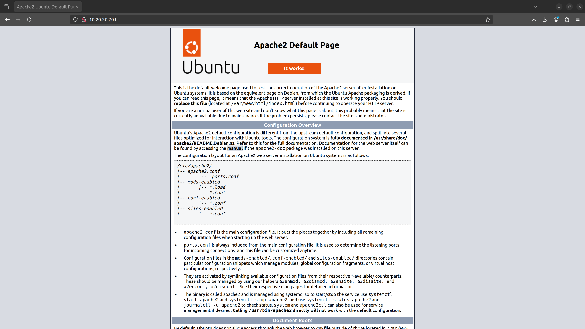
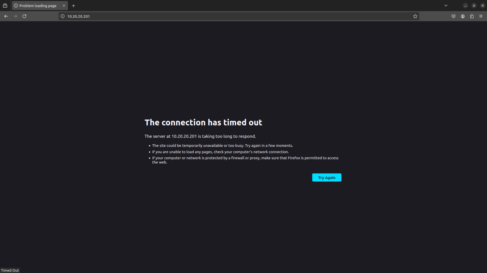

Explore full potential of OpenStack
###################################

Welcome!

We hope that both you and your team are now getting up to speed with `Canonical OpenStack`_. We've
already learned how to deploy the cloud, interact with it and provision cloud resources (i.e.
VMs). But OpenStack is not just a virtualisation platform. Its potential spans far beyond that.

In this tutorial we will demonstrate how to use a wider spectrum of the capabilities of
OpenStack available to handle a real life scenario. We will provision two VMs with the
Apache HTTP Server installed and set up a load balancer in front of them. Moreover, we will
automate the whole process using the OpenStack orchestration service (Heat).

Ready to take your knowledge to the next level? Let's explore full potential of OpenStack together!

.. note ::

   This tutorial is intended to serve for learning purposes only. If you're looking for detailed instructions on how to deploy a production-grade cloud, please refer to the How-to Guides section of this documentation instead.

.. TODO: Add a link to the "How-to guides" section

Requirements
++++++++++++

You will only need one dedicated physical machine with:

* Canonical OpenStack deployed according to instructions listed under the "Get started with OpenStack" tutorial,
* OpenStack client configured according to instructions listed under the "Get familiar with OpenStack" tutorial,
* A new project and a user account created according to instructions listed under the "On-board your users" tutorial.

.. TODO: Add a link to tutorial-1, tutorial-2 and tutorial-3

You can also use a virtual machine instead, but you can expect some performance degradation in this case.

.. warning ::

   All terminal commands used in this series of tutorials are run from the aforementioned machine. All web browser examples presented in this series of tutorials are run from the aforementioned machine. Neither OpenStack APIs nor any of the provisioned cloud resources, including VMs and floating IPs will be accessible from any other machine in your network than the aforementioned one. Everything runs on that machine. But it runs and it works!

Credentials
+++++++++++

Make sure you're logged in as the *admin* user and not as *demo* or *myuser* users.

To log in as the *admin* user, open a new terminal window and execute the following command:

.. code-block :: text

   source <(sunbeam openrc)

Enable additional features
++++++++++++++++++++++++++

.. note ::

   **Duration:** 10 minutes (exact time might vary depending on your Internet connection speed)

We're going to start with enabling two additional optional features in Canonical OpenStack:

* **loadbalancer** - this feature deploys `Octavia <https://docs.openstack.org/octavia/latest/>`_, the OpenStack load balancing service,
* **orchestration** - this feature deploys `Heat <https://docs.openstack.org/heat/latest/>`_, the OpenStack orchestration service.

To enable the first feature, execute the following command:

.. code-block :: text

   sunbeam enable loadbalancer

After a while, you should be able to see the following message on your screen:

.. code-block :: text

   OpenStack loadbalancer application enabled.

To enable the other one, run:

.. code-block :: text

   sunbeam enable orchestration

After a while, this should result in:

.. code-block :: text

   OpenStack orchestration application enabled.

Assign the *load-balancer_member* role
++++++++++++++++++++++++++++++++++++++

.. note ::

   **Duration:** 1 minute

To be able to create and manage load balancers, users must have the *load-balancer_member* role
assigned.

Execute the following command to assign the *load-balancer_member* role to the *myuser* user in the *myproject* project:
   
.. code-block :: text

   openstack role add --project myproject --project-domain users --user myuser --user-domain users load-balancer_member

Then open a new terminal window, and log in as the *myuser* user:

.. code-block :: text

   source ~/Downloads/myproject-openrc.sh

Create the stack
++++++++++++++++

.. note ::

   **Duration:** 6 minutes

The OpenStack orchestration service enables creating stacks consisting of multiple cloud resources. Those can be VMs, networks, floating IPs, load balancers or even individual security rules. The main advantage of Heat over custom scripts and third-party tools is that it manages dependencies automatically and enables cross-resource references. For example, you can create a floating IP and  associate it with a VM without knowing its exact value.

Heat uses `Heat Orchestration Templates (HOTs) <https://docs.openstack.org/heat/latest/template_guide/hot_spec.html>`_ which are YAML files that contain full description of stacks being created. Below is a HOT that we'll use in the following example. It creates two VMs, installs the *apache2* package on them and creates a load balancer with a floating IP address attached. You can refer to individual sections of this file as they provide some meaningful instructions on what happens in every single step:

.. code-block :: text

   heat_template_version: 2018-08-31

   description: >
     Example template to launch 2 VMs with a load balancer in front of them.

   parameters:
     image:
       type: string
       description: The image to be used
       default: ubuntu
     flavor:
       type: string
       description: The flavor to be used
       default: m1.tiny
     network:
       type: string
       description: The network to be used
       default: mynetwork
     subnet:
       type: string
       description: The subnet to be used
       default: mysubnet
     external_network:
       type: string
       description: The external network for floating IP assignment
       default: external-network
     security_group:
       type: string
       description: The security group to be used
       default: default

   resources:
     myinstance1:
       type: OS::Nova::Server
       description: The first VM to be created
       properties:
         name: myinstance1
         image: { get_param: image }
         flavor: { get_param: flavor }
         networks:
           - network: { get_param: network }
         user_data_format: RAW
         user_data: |
           #cloud-config
           packages:
             - apache2
           runcmd:
             - systemctl start apache2

     myinstance2:
       type: OS::Nova::Server
       description: The second VM to be created
       properties:
         name: myinstance2
         image: { get_param: image }
         flavor: { get_param: flavor }
         networks:
           - network: { get_param: network }
         user_data_format: RAW
         user_data: |
           #cloud-config
           packages:
             - apache2
           runcmd:
             - systemctl start apache2

     lb:
       type: OS::Octavia::LoadBalancer
       description: The load balancer to be created
       properties:
         name: myloadbalancer
         vip_subnet: { get_param: subnet }

     listener:
       type: OS::Octavia::Listener
       description: The load balancer listener to be created
       properties:
         name: mylistener
         loadbalancer: { get_resource: lb }
         protocol: TCP
         protocol_port: 80

     pool:
       type: OS::Octavia::Pool
       description: The load balancer pool to be created
       properties:
         name: mypool
         listener: { get_resource: listener }
         protocol: TCP
         lb_algorithm: SOURCE_IP_PORT

     member1:
       type: OS::Octavia::PoolMember
       description: Adds the first VM to the pool
       properties:
         pool: { get_resource: pool }
         address: { get_attr: [myinstance1, first_address] }
         protocol_port: 80
         subnet: { get_param: subnet }

     member2:
       type: OS::Octavia::PoolMember
       description: Adds the second VM to the pool
       properties:
         pool: { get_resource: pool }
         address: { get_attr: [myinstance2, first_address] }
         protocol_port: 80
         subnet: { get_param: subnet }

     healthmonitor:
       type: OS::Octavia::HealthMonitor
       description: The health monitor to be created
       properties:
         delay: 7
         timeout: 5
         max_retries: 3
         type: TCP
         pool: { get_resource: pool }

     floating_ip:
       type: OS::Neutron::FloatingIP
       description: The floating IP to be created
       properties:
         floating_network: {get_param: external_network }

     floating_ip_assoc:
       type: OS::Neutron::FloatingIPAssociation
       description: Associates the floating IP with the load balancer's port
       properties:
         floatingip_id: { get_resource: floating_ip }
         port_id: { get_attr: [lb, vip_port_id] }

     security_group_rule:
       type: OS::Neutron::SecurityGroupRule
       description: Allows inbound HTTP connections under the default security group
       properties:
         security_group: { get_param: security_group }
         protocol: tcp
         direction: ingress
         remote_ip_prefix: 0.0.0.0/0
         port_range_min: 80
         port_range_max: 80

   outputs:
     loadbalancer_ip:
       description: The floating IP of the load balancer
       value: { get_attr: [floating_ip, floating_ip_address] }

Save this file as ``template.yaml`` on the machine with Canonical OpenStack installed.
   
Then, to create a stack called *mystack*, execute the following command:

.. code-block :: text

   openstack stack create -t template.yaml mystack

After a while you should be able to see the *mystack* stack in the ``CREATE_COMPLETE`` status on the list of available stacks:

.. code-block :: text

   openstack stack list

To check the floating IP on which the load balancer is listening to incoming connections, run:

.. code-block :: text

   openstack stack show mystack -c outputs

Sample output:

.. code-block :: text

   +---------+-----------------------------------------------------+
   | Field   | Value                                               |
   +---------+-----------------------------------------------------+
   | outputs | - description: The floating IP of the load balancer |
   |         |   output_key: loadbalancer_ip                       |
   |         |   output_value: 10.20.20.201                        |
   |         |                                                     |
   +---------+-----------------------------------------------------+

In this case the load balancer is listening at the ``10.20.20.201`` floating IP address.

Test the stack
++++++++++++++

.. note ::

   **Duration:** 2 minutes

The best way to test the entire stack is to visit the floating IP of the load balancer. Simply open your web browser and go directly to this IP (here ``10.20.20.201`` ). You should be able to see the Apache HTTP Server's default page:

Then, stop the first VM (``myinstance1``):

.. code-block :: text

   openstack server stop myinstance1

And go to the load balancer's floating IP again. The page should be still up:

Then, stop the second VM (``myinstance2``):

.. code-block :: text

   openstack server stop myinstance2

At this point, the Apache HTTP Server's default page will no longer show up in the browser:

Note that you might need to clean up your history or use an incognito mode. Otherwise, the page might still be cached in your browser.

Delete the stack
++++++++++++++++

.. note ::

   **Duration:** 1 minute

In order to the delete the stack together with all the resources that have been created, execute the following command:

.. code-block :: text

   openstack stack delete mystack

When prompted, type ``y`` and press ``Enter``:

.. code-block :: text

   Are you sure you want to delete this stack(s) [y/N]? y

Next steps
++++++++++

Congratulations!

You have reached the end of this tutorial and the whole series of tutorials we prepared to help you get up to speed with Canonical OpenStack.

You can now explore our How-to Guides for instructions on setting up a production-grade environment.

Good luck!

.. TODO: Add a link to the How-to guides section
