Get familiar with OpenStack
###########################

Welcome!

It's great to see that you decided to continue your journey with `Canonical OpenStack`_. In the
:doc:`previous tutorial</tutorial/get-started-with-openstack>` we showed you how to get started
with OpenStack in five simple steps. By executing just a few terminal commands we deployed
Canonical OpenStack for sample usage and got our first VM running on top of it. Now that the cloud
is up and running we'll dig a little bit deeper into it.

In this tutorial we will help you to get familiar with Canonical OpenStack. We will show you how
to use both OpenStack dashboard and OpenStack client for the purpose of provisioning cloud
resources. We will also demonstrate how to use the Sunbeam client for Canonical OpenStack daily
operations.

Ready for the next step? Let's dig into OpenStack together!

.. note ::

   This tutorial is intended to serve for learning purposes only. If you're looking for detailed instructions on how to deploy a production-grade cloud, please refer to the :doc:`How-to Guides section</how-to/index>` of this documentation instead.

Requirements
++++++++++++

You will only need one dedicated physical machine with:

* Canonical OpenStack deployed according to instructions listed under the :doc:`"Get started with OpenStack"</tutorial/get-started-with-openstack>` tutorial.

You can also use a virtual machine instead, but you can expect some performance degradation in this case.

.. warning ::

   All terminal commands used in this series of tutorials are run from the aforementioned machine. All web browser examples presented in this series of tutorials are run from the aforementioned machine. Neither OpenStack APIs nor any of the provisioned cloud resources, including VMs and floating IPs will be accessible from any other machine in your network than the aforementioned one. Everything runs on that machine. But it runs and it works!

Get familiar with the OpenStack dashboard
+++++++++++++++++++++++++++++++++++++++++

.. note ::

   **Duration:** 5 minutes

The `OpenStack dashboard <https://docs.openstack.org/horizon/latest/>`_ is often a preferred way to interact with the cloud. It provides a web interface that enables users to provision and manage cloud resources on demand.

To log in to the OpenStack dashboard, first, obtain the *admin* user password:

.. code-block :: text

   sunbeam openrc | grep OS_PASSWORD | cut -f 2 -d "="

Sample output:

.. code-block :: text

   uQ5ztnVmWyMf

Then, obtain the *admin* user domain:

.. code-block :: text

   sunbeam openrc | grep OS_USER_DOMAIN_NAME | cut -f 2 -d "="

Sample output:

.. code-block :: text

   admin_domain

Lastly, obtain the OpenStack dashboard URL:

.. code-block :: text

   sunbeam dashboard-url

Sample output:

.. code-block :: text

   http://10.20.21.12:80/openstack-horizon

Finally, visit this URL, type the credentials obtained, and click the **Sign in** button:

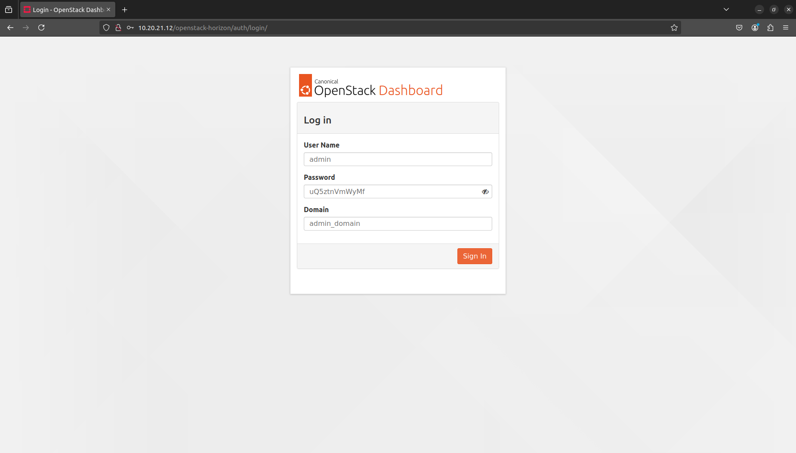

You should now be able to see the OpenStack dashboard:

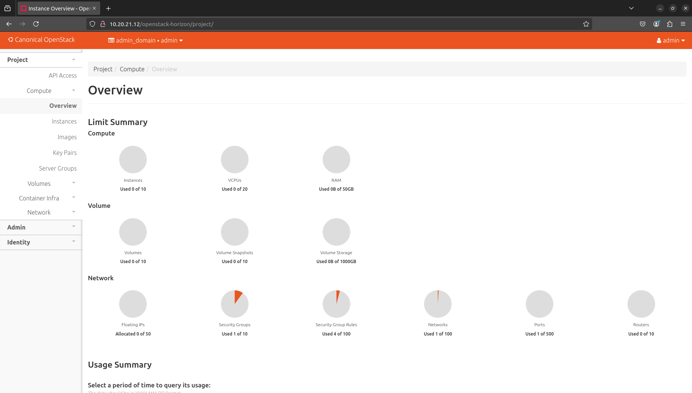

The **Project** menu on the left is grouped into four sections:

* **API Access** provides information about OpenStack service API endpoints,
* **Compute** provides access to project's compute resources, such as instances,
* **Volumes** provides access to project's storage resources, such as volumes,
* **Network** provides access to project's network resources, such as virtual networks.

For example, to list all images available in the *admin* project, navigate to **Project** → **Compute** → **Images**:

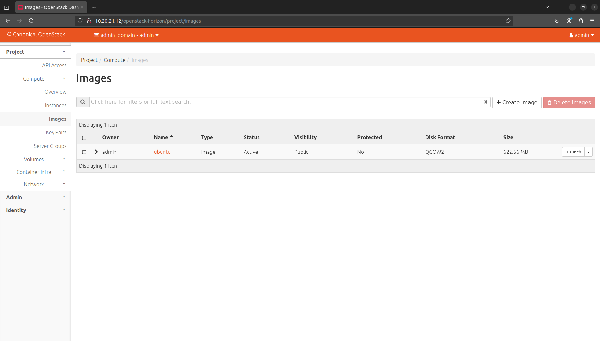

The **Admin** menu on the left is grouped into five sections:

* **Overview** displays usage metrics across all projects,
* **Compute** provides access to global compute settings, such as hypervisors,
* **Storage** provides access to global storage settings, such as volume types,
* **Network** provides access to global network settings, such as RBAC policies,
* **System** provides access to various system information.

For example, to list all flavors that were defined, navigate to **Admin** → **Compute** →
**Flavors**:

.. figure:: images/get-familiar-with-openstack-04.png
   :align: center

The **Identity** menu on the left is grouped into six sections:

* **Domains** provides access to domains,
* **Projects** provides access to projects,
* **Users** provides access to user accounts,
* **Groups** provides access to user groups,
* **Roles** provides access to user roles.
* **Application Credentials** provides access to application credentials.

For example, to list all projects under the *admin_domain* domain, navigate to **Identity** → **Projects**:

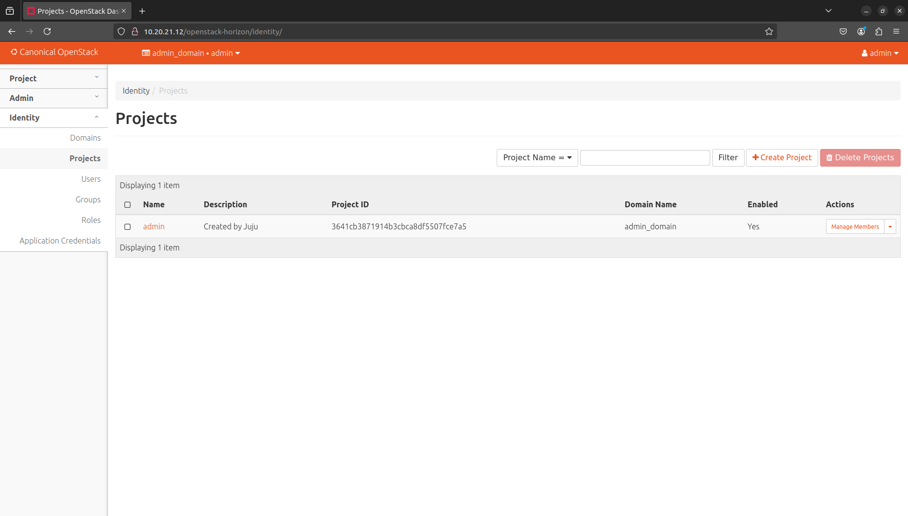

Get familiar with the OpenStack client
++++++++++++++++++++++++++++++++++++++

.. note ::

   **Duration:** 3 minutes

In addition to the OpenStack dashboard, users can also use the
`OpenStack client <https://docs.openstack.org/python-openstackclient/latest/>`_ to interact with
the cloud. While the dashboard helps to visualize the environment and all the resources being
used, the client provides a command line interface which is especially useful when performing
bulk operations or automating administrative tasks.
   
To interact with the cloud through the OpenStack client, first, set necessary environmental variables:

.. code-block :: text

   source <(sunbeam openrc)

We will explore in another tutorial what those variables are and how does OpenStack manage identities.

You should now be able to use the ``openstack`` command to interact with the cloud:

.. code-block :: text

   openstack --help

For example, to list all OpenStack API endpoints, execute the following command:

.. code-block :: text

   openstack catalog list

Sample output excerpt:

.. code-block :: text

   +-----------+-----------+----------------------------------------------------------------------------------------+
   | Name      | Type      | Endpoints                                                                              |
   +-----------+-----------+----------------------------------------------------------------------------------------+
   | glance    | image     | RegionOne                                                                              |
   |           |           |   internal: http://10.20.21.13:80/openstack-glance                                     |
   |           |           | RegionOne                                                                              |
   |           |           |   public: http://10.20.21.12:80/openstack-glance                                       |
   |           |           | RegionOne                                                                              |
   |           |           |   admin: http://10.152.183.136:9292                                                    |
   |           |           |                                                                                        |

   . . .

   +-----------+-----------+----------------------------------------------------------------------------------------+

Provision cloud resource
++++++++++++++++++++++++

.. note ::

   **Duration:** 8 minutes

Now that you've learned how to use both OpenStack dashboard and OpenStack client, we're going to
see how those tools can be used to provision cloud resources. In the previous tutorial -
:doc:`"Getting started with OpenStack"</tutorial/get-started-with-openstack>` -  we launched our
first test VM. In the following steps we're going to check how this process looks like in details
under the hood.

We will use *demo* project for this purpose that was automatically created by Sunbeam during the Canonical OpenStack deployment. This is because the *demo* project already has all the necessary configuration and required resources in place to enable VM provisioning. We will explore in another tutorial how to setup a new project in OpenStack from scratch.

Launch a VM through the OpenStack dashboard
-------------------------------------------

To log in to the dashboard as a *demo* user, first, obtain the *demo* user password:

.. code-block :: text

   cat demo-openrc | grep OS_PASSWORD | cut -f 2 -d "="

Sample output:

.. code-block :: text

   SbH0bjVKqPAT

Then, log out from the dashboard (select **Sign Out** from the **admin** drop-down menu on the top right corner):

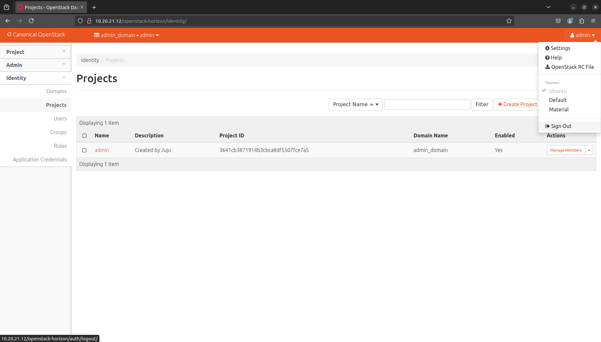

And log in again using the following credentials:

* **User Name**: type ``demo``
* **Password**: type the password you obtained in the previous step
* **Domain**: type ``users``

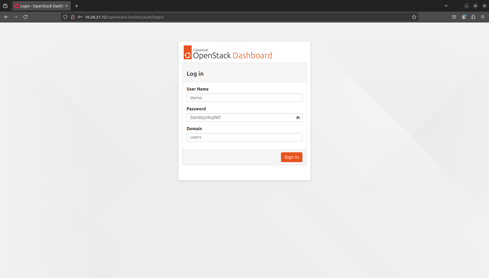

Launch a VM
^^^^^^^^^^^

Now, once you are back, navigate to **Project** → **Compute** → **Instances** and click the **Launch Instance** button on the right to initiate the VM launch process:

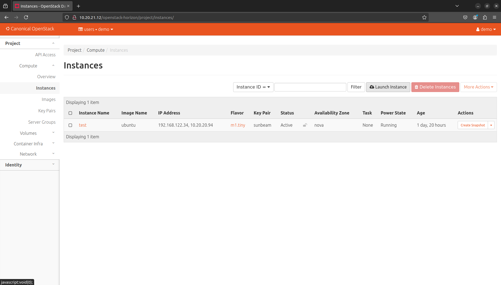

To launch a new VM called *my_instance_1*, fill in the form as follows:

* **Instance Name**: type ``my_instance_1``

Then, choose **Source** from the menu on the left:

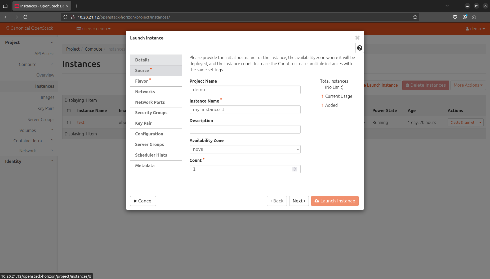

To use the default *ubuntu* image, fill in the form as follows:

* **Create New Volume**: Choose No
* Press **UP** beside *ubuntu*

Then, choose **Flavor** from the menu on the left:

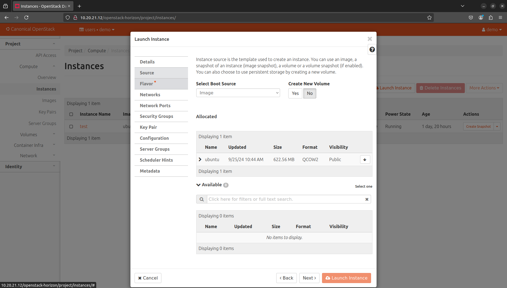

To use the default *m1.tiny* `flavor <https://docs.openstack.org/nova/latest/user/flavors.html>`_, fill in the form as follows:

* Press **UP**  beside *m1.tiny*

Finally, click the **Launch Instance** button:

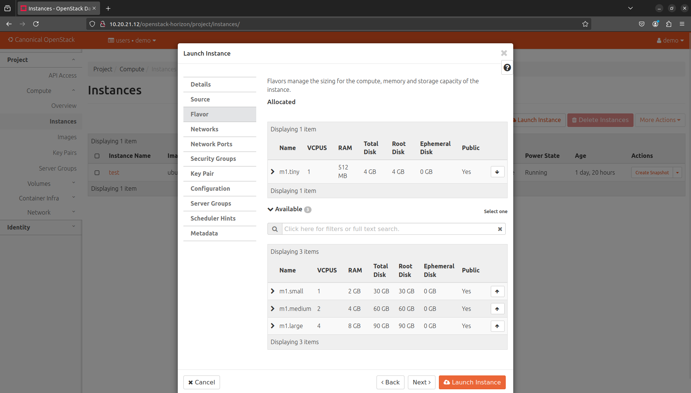

Launching instances takes a while. You are going to see that the instance goes through the *Scheduling* and *Spawning* stages until it reaches an *Active* status. Once this process completes, you should be able to see your instance in the OpenStack dashboard:

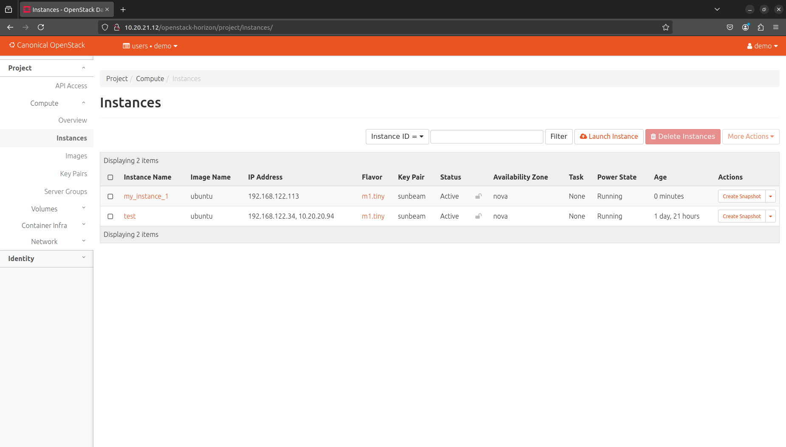

Associate a floating IP address
^^^^^^^^^^^^^^^^^^^^^^^^^^^^^^^

To be able to connect to the VM via SSH, we have to associate a `floating IP address
<https://docs.openstack.org/python-openstackclient/latest/cli/command-objects/floating-ip.html>`__
with it. Floating IPs are allocated from the OpenStack
:doc:`external network</explanation/architecture>` and should be routable within your data center
to ensure an inbound access to VMs.

Under the **Actions** column beside *my_instance_1*, select **Associate Floating IP** from the drop-down menu:

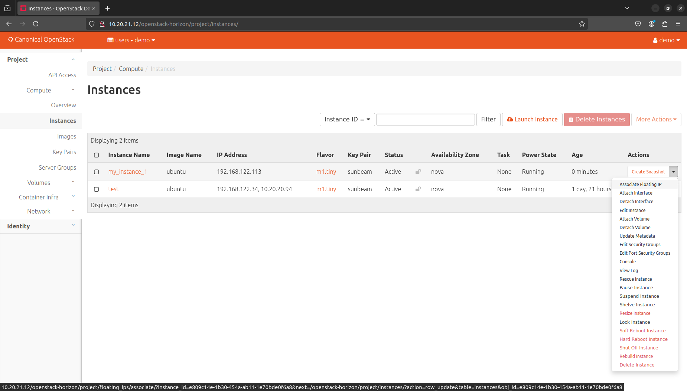

Press **Plus** beside the **IP Address** field:

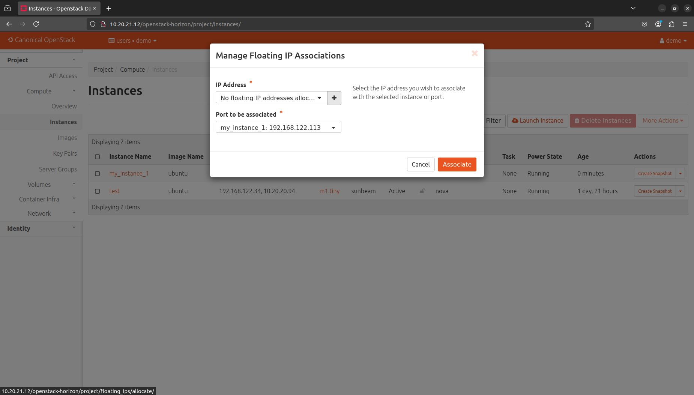

Then, click the **Allocate IP** button:

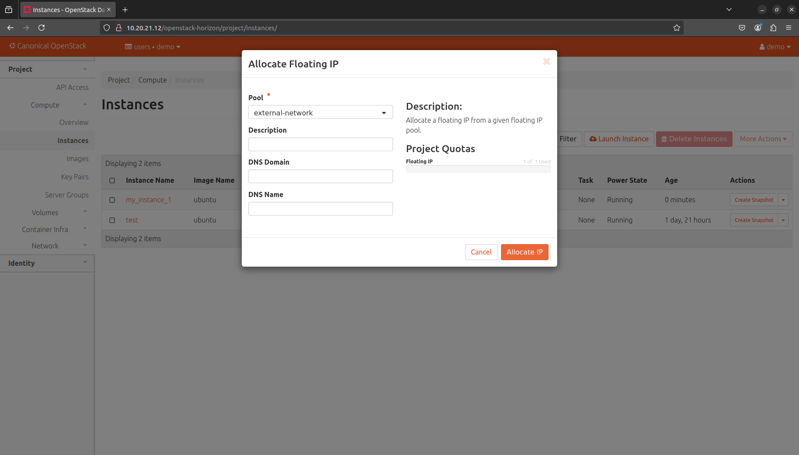

Lastly, to associate the newly created floating IP with the *my_instance_1* VM, fill in the form as follows:

* **IP Address** - Select the available IP address from the drop-down menu (*10.20.20.32* in this case)

Then click the **Associate** button:

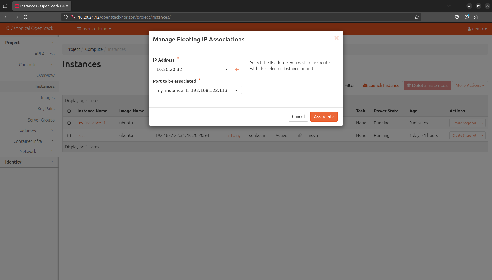

You should now able to see the floating IP being associated with the VM:

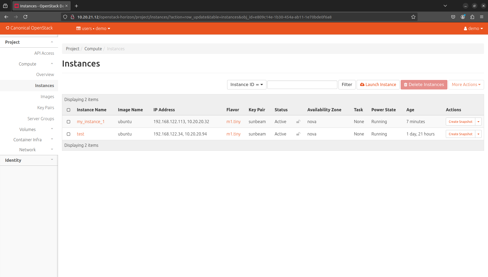

Connect to the VM
^^^^^^^^^^^^^^^^^

Ubuntu cloud images are distributed with no default username/password set. This means that by default you won't be able to log into the *my_instance_1* VM via console. Therefore, we'll connect to it over SSH first and set the *ubuntu* user's password manually.
 
Connect to the VM over SSH
""""""""""""""""""""""""""
   
To connect to the *my_instance_1* VM over SSH, execute the following commands:

.. code-block :: text

   IP=$(openstack server list --all-projects | grep my_instance_1 | awk '{print $8}' | cut -f 2 -d '=' | cut -f 1 -d ',')
   ssh -i ~/snap/openstack/current/sunbeam ubuntu@$IP

Then, set the password (here *my_password*) for the *ubuntu* user on the VM:

.. code-block :: text

   sudo chpasswd <<<"ubuntu:my_password"

To disconnect from the VM, type ``exit`` or press CTRL+D instead.

Connect to the VM via console
"""""""""""""""""""""""""""""

Under the **Actions** column beside *my_instance_1*, select **Console** from the drop-down menu:

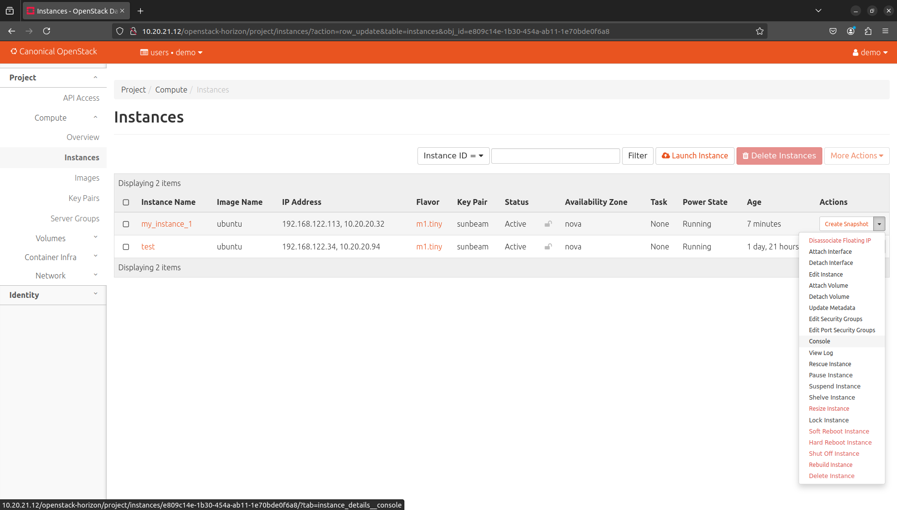

You should now be able to see the console and log into the *my_instance_1* VM using the password we set in the previous step (*my_password*):

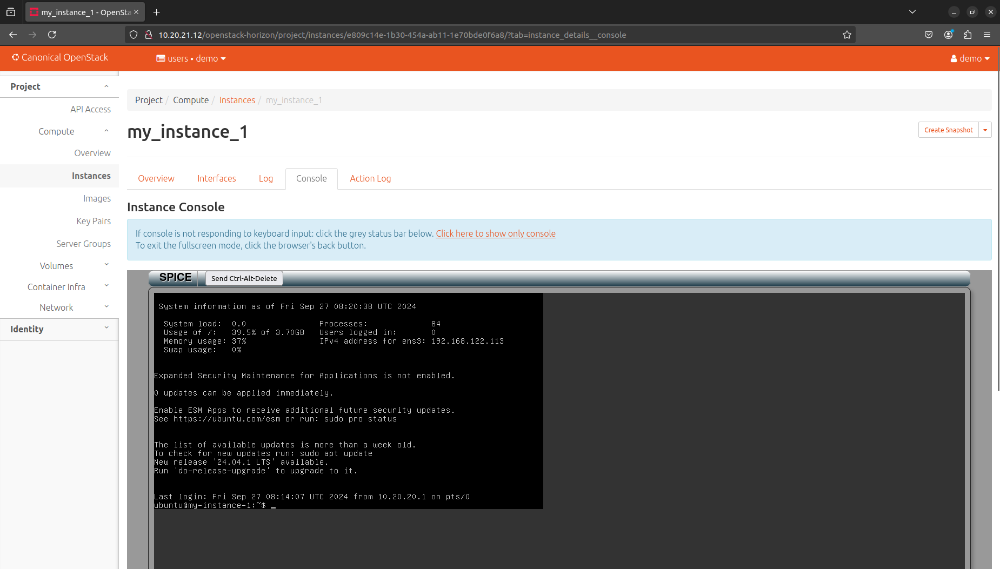

Launch a VM through the OpenStack client
----------------------------------------

To log in to the client as a *demo* user, execute the following command:

.. code-block :: text

   source demo-openrc

Launch a VM
^^^^^^^^^^^

To launch another VM called *my_instance_2* with exactly the same configuration, execute the following command:

.. code-block :: text

   openstack server create --flavor m1.tiny --image ubuntu --network demo-network --key-name sunbeam my_instance_2

Launching instances takes a while. You are going to see that the instance goes through the *BUILD* status first.

To list all instances, execute the following command:

.. code-block :: text

   openstack server list

Sample output:

.. code-block :: text

   --------------------------------------+---------------+--------+-------------------------------------------+--------+---------+
   | ID                                   | Name          | Status | Networks                                  | Image  | Flavor  |
   +--------------------------------------+---------------+--------+-------------------------------------------+--------+---------+
   | 3482b599-6289-4cbf-90a8-8ddbf62a198c | my_instance_2 | ACTIVE | demo-network=192.168.122.77               | ubuntu | m1.tiny |
   | e809c14e-1b30-454a-ab11-1e70bde0f6a8 | my_instance_1 | ACTIVE | demo-network=10.20.20.32, 192.168.122.113 | ubuntu | m1.tiny |
   | d3446139-09b5-4306-8208-3e50c1808566 | test          | ACTIVE | demo-network=10.20.20.94, 192.168.122.34  | ubuntu | m1.tiny |
   +--------------------------------------+---------------+--------+-------------------------------------------+--------+---------+
 
Associate a floating IP address
^^^^^^^^^^^^^^^^^^^^^^^^^^^^^^^

To create a floating IP, execute the following command:

.. code-block :: text

   openstack floating ip create external-network

To associate newly created floating IP with the *my_instance_2* VM, execute the following commands:

.. code-block :: text

   IP=$(penstack floating ip list | awk '/None/ { print $4 }')
   openstack server add floating ip my_instance_2 $IP

Connect to the VM
^^^^^^^^^^^^^^^^^

To connect to the *my_instance_2* VM over SSH, execute the following commands:

.. code-block :: text
   
   ssh -i ~/snap/openstack/current/sunbeam ubuntu@$IP

You should now be able to see the VM terminal:

.. code-block :: text
   
   ubuntu@my-instance-2:~$

To disconnect from the VM, type ``exit`` or press CTRL+D instead.

Get familiar with the Sunbeam client
++++++++++++++++++++++++++++++++++++

.. note ::

   **Duration:** 4 minutes

So far we've seen how users can interact with the cloud to provision and manage cloud resources. However, when it comes to Canonical OpenStack operations there is one more tool that you should get familiar with as an operator.

We've already seen in those tutorials the usage of the ``sunbeam`` command on multiple occasions. This command is provided by the Sunbeam client which is a command line interface designed to bootstrap and operate Canonical OpenStack.

To operate the cloud through the Sunbeam client, execute the ``sunbeam`` command:

.. code-block :: text

   sunbeam --help

For example, to enable the :doc:`Ubuntu Pro feature</how-to/features/ubuntu-pro>`, execute the following command:

.. code-block :: text

   sunbeam enable pro --token <ubuntu pro token>

.. note ::

   Enablement of the Ubuntu Pro feature requires an active Ubuntu Pro subscription. You can get your token at `your subscriptions page <https://ubuntu.com/pro/dashboard>`_ or request one `here <https://ubuntu.com/pro/subscribe>`_. **It's free** for limited personal usage.

Once this command finishes, you should be able to see the following message on the screen:

.. code-block :: text

   Please check minimum hardware requirements for support:

       https://microstack.run/docs/enterprise-reqs

   Ubuntu Pro enabled.

.. TODO:: Update the link to the enterprise requirements page

Depending on the subscription type, your machine is now eligible for certain Ubuntu Pro services:

.. code-block :: text

   $ pro status
   SERVICE          ENTITLED  STATUS       DESCRIPTION
   anbox-cloud      yes       disabled     Scalable Android in the cloud
   esm-apps         yes       enabled      Expanded Security Maintenance for Applications
   esm-infra        yes       enabled      Expanded Security Maintenance for Infrastructure
   fips-preview     yes       disabled     Preview of FIPS crypto packages undergoing certification with NIST
   fips-updates     yes       disabled     FIPS compliant crypto packages with stable security updates
   livepatch        yes       enabled      Canonical Livepatch service
   realtime-kernel* yes       disabled     Ubuntu kernel with PREEMPT_RT patches integrated
   usg              yes       disabled     Security compliance and audit tools

Next steps
++++++++++

Congratulations!

You have reached the end of this tutorial.

You can now:

* Move to the next tutorial in this series - :doc:`"On-board your users"</tutorial/on-board-your-users>`,
* Explore :doc:`How-to Guides</how-to/index>` for instructions on setting up a production-grade environment.
